Windows 7 Setup
===============

* Start a command prompt
* Get Java installed
* Get Leiningen installed
* Get Light Table installed
* Get Git installed
* Test installation
* Troubleshooting

## Starting a command prompt

For these instructions, and for much of the class, you will need to have a command prompt open. This is a text-based interface to talk to your computer. Go to the Start Menu and type "command" in the search box. Choose the "Command Prompt" program, like in this screenshot:

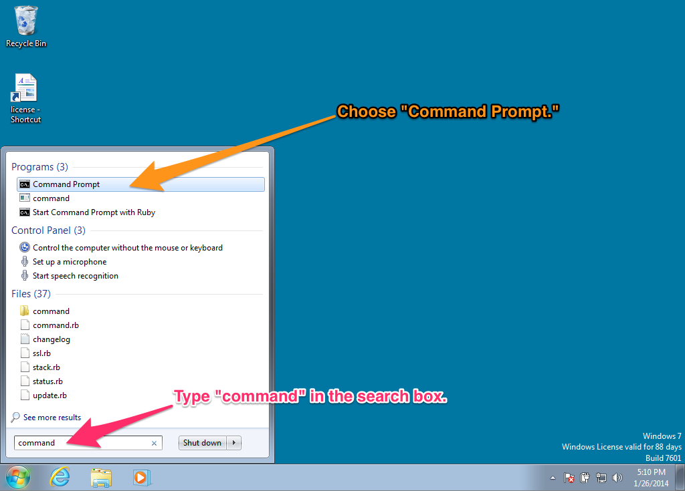

When you choose "Command Prompt," your screen should look similar to this:

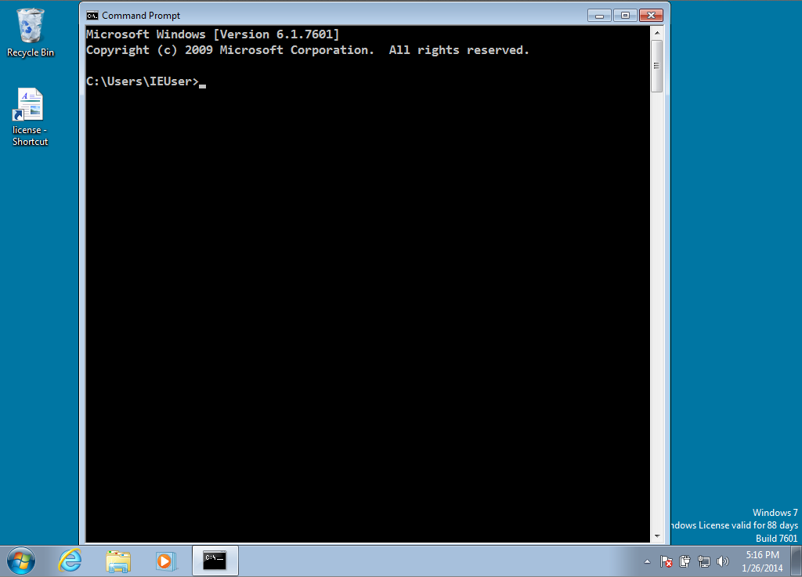

If you have never used the command prompt before, you may want to spend some time [reading up on command prompt basics](http://dosprompt.info/). For the rest of this setup, I will tell you to run commands in your command prompt. When I say that, I mean "type the command into the command prompt and press the Return key."

On other operating systems, the command prompt is called the terminal. We will use the terms terminal, command prompt, and command line interchangably.

## Installing Java

Go to [the Leiningen Windows installer site](http://leiningen-win-installer.djpowell.net/). You should see two links, one for installing Java and another for "leiningen-win-installer." Click the Java link. Then, you should see a screen like the following:

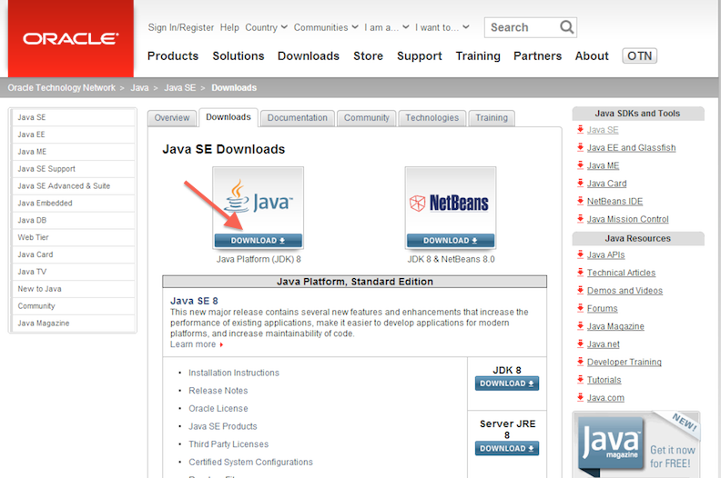

Click the button above "Java Platform (JDK)," as you can see in the above picture. Then you will come to a page that will have the following table on it:

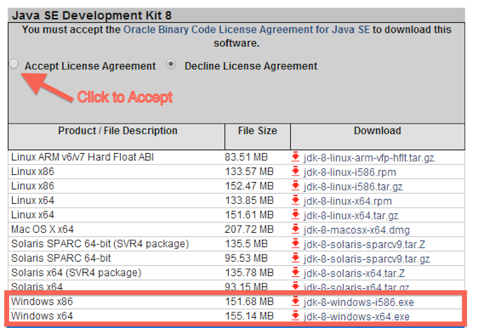

Click the radio button to accept the license agreement, and then download one of the two Windows choices. If you are running 32-bit Windows, choose "Windows x86." If you are running 64-bit Windows, choose "Windows x64."

If you do not know if you are running 32-bit or 64-bit Windows, go to the Control Panel (Start Menu - Control Panel) and choose "System and Security" and then "System." You should see a window like the following:


You should see if you are running 32- or 64-bit Windows beside "System Type."

Once you have downloaded the right Java version, run the executable you downloaded to install Java. Follow the installation wizard.

## Installing Leiningen

Leiningen is a tool used on the command line to manage Clojure projects.

Next, go back to [the Leiningen Windows installer site](http://leiningen-win-installer.djpowell.net/) and download the file linked as "leiningen-win-installer." Run this executable and follow the "Detailed installation" section at the Leiningen Windows Installer site. At the end of the installation, leave "Run a Clojure REPL" checked before you click "Finish." If a terminal window opens that looks like the one on the Leiningen Windows installer site, then you are good to go.

## Installing Light Table

Go to the [Light Table site](http://www.lighttable.com/). On the page there, you should see a set of buttons that have download links for Light Table. Click the "Win" button and you will download a .zip file.

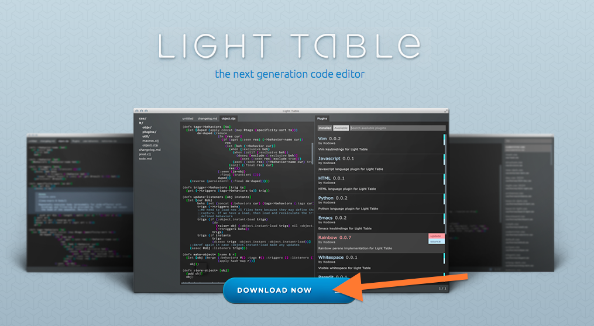
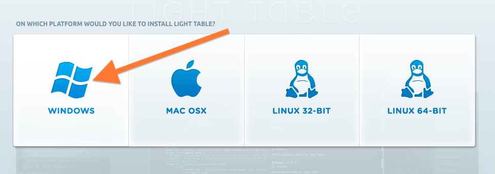

Unzip this file (either by finding it in your Downloads folder and double-clicking it, or by choosing "Open" when downloading.) Inside the .zip file, there is a a directory called "Light Table". Drag this to your desktop. (If you know what you are doing and want this somewhere else, that is fine.)

Inside the Light Table directory, there is an application called Light Table. Right-click it and choose "Pin to Start Menu" so you can start it more quickly.

## Installing Git

See if you already have Git installed at the command prompt with the command `git --version`.
If not, download it from the [git-scm.com Windows download page](http://git-scm.com/download/win) and run the executable to install.

After installation, try the `git --version` command in a new command prompt window. If you see a version number, git
was installed correctly.

If you see a message that says, `'git' is not recognized as an internal or external command`,
try these steps to update your PATH variable properly:
* Right-click "My Computer" and select "Properties".
* Click the "Advanced Tab" and then the "Environment Variables" button.
* Highlight the PATH entry and click "Edit".
* Scroll to the end of this value and check for a file path at the end that includes "...\Git...".
* If that path existed:
  * Click "Okay" until the "My Computer" dialog box is closed.
  * Open a new command prompt window and try `git --version` again. If that does not succeed, restart your computer and try again.
* If that path did not exist:
  * If you did not change the install location of git during installation, add ";C:\Program Files (x86)\Git\cmd" to the end of the line. Make sure you add the semi-colon between file paths and the line includes no spaces between paths.
  * Click "Okay" until the "My Computer" dialog box is closed.
  * Open a new command prompt window and try `git --version` again. If that does not succeed, restart your computer and try again.

If you've used Git before then you should already have user.name and user.email configured.
Otherwise, type this in the command prompt:

```
git config --global user.name "Your Actual Name"
git config --global user.email "Your Actual Email"
```
TIP: Use the same email address for git, github, and ssh.

Verify by typing this in the command prompt:

`git config --get user.name`
Expected result:
`your name`

`git config --get user.email`
Expected result:
`your email address`

## Testing your setup

You have set up Java, Leiningen, Light Table, and Git on your computer, all the tools you will need for this program. Before starting, we need to test them out. Make sure you have a terminal (OS X) or command prompt (Windows) open for testing. We will just call this a terminal from now on.

Go to your terminal and run the following command:

`git clone https://github.com/heroku/clojure-sample.git`

This will check out a sample Clojure application from GitHub, a central repository for lots of source code. Your terminal should look similar to this picture:

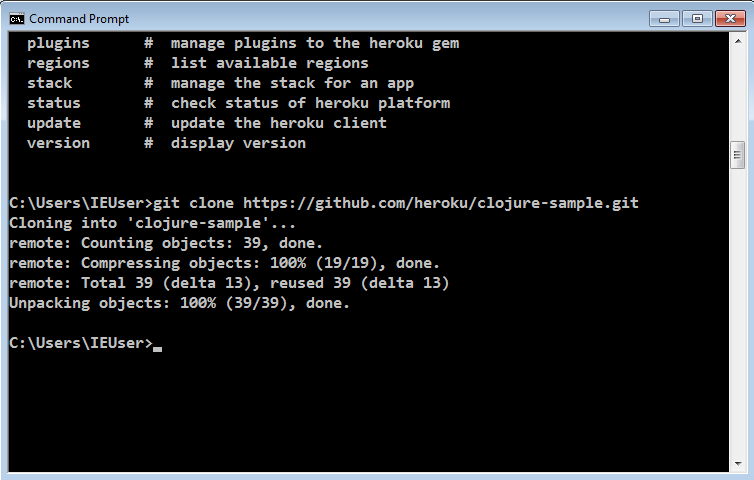

Then run the command:

`cd clojure-sample`

This will put you in the directory with the source code for this sample bit of Clojure code. After that completes, run:

`lein repl`

This could take a long time, and will download many other pieces of code it relies on. You should see lines that start with `Retrieving ...` on your screen. When it finishes, your terminal should look like the following:

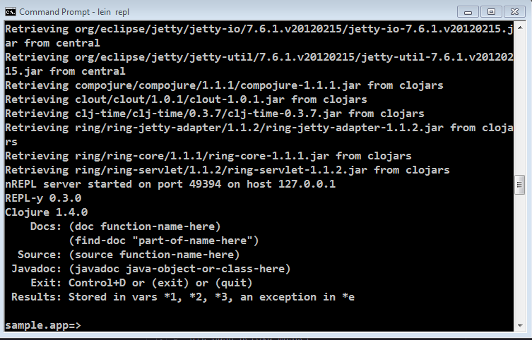

This is starting a REPL, which we will learn about soon. It's a special terminal for Clojure. At the REPL prompt, type `(+  1  1)` and hit enter. Did you get the answer `2` back? You will learn more about that in the course. For now, press the Control button and D button on your keyboard together (abbreviated as Ctrl+D). This should take you out of the Clojure REPL and back to your normal terminal prompt.

Now, start Light Table. Once it is started, press the Control button and Space Bar together (abbreviated Ctrl+Space). This is how you start giving Light Table a command. Start typing the word "instarepl" and you should see a menu of options, like below. Choose "Instarepl: open a clojure instarepl."

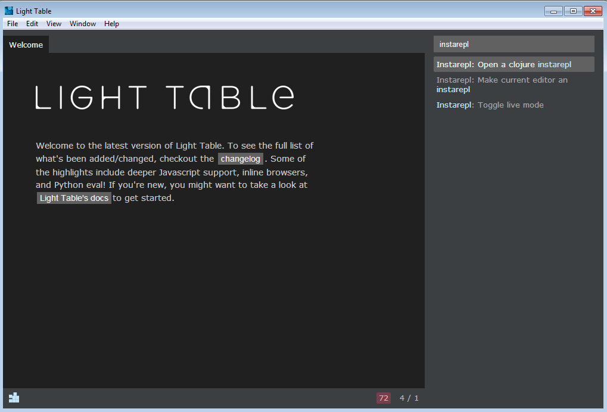

At the bottom of the screen, you will see a cube moving and some text about connecting and installing dependencies. Once that stops moving, type `(+ 1 1)` into the window. It should look like the following image:

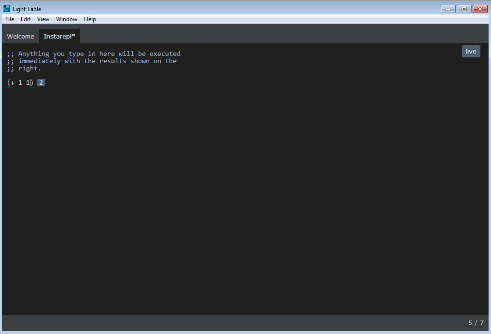

If that worked, great! Close Light Table. 

Finally, let's make sure the application you downloaded will run properly.  To test this, you will use Leiningen to run the application on your computer.  As this is a (very simple) web application, you should be able to use a web browser to see it runnning in all its humble glory.  Let's start with

```
lein run
```

This tells Leiningen to run your application.  Different applications run in different ways - this one starts up it's own little webserver on your computer.  If this is the first time you've run a web application, the output in the Terminal window (see below) may not make much sense, so let's test the application in a browser.

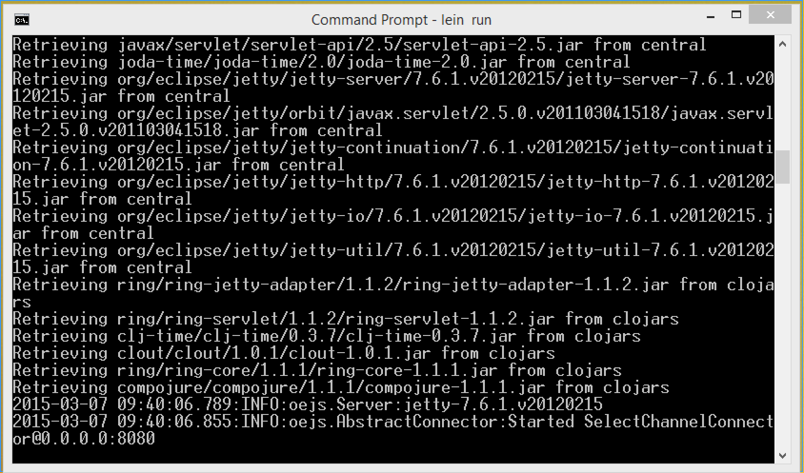

You now need to open a web browser (Chrome, Firefox, Safari, etc) and point it towards the application running on your computer.  Enter the following URL to access your application:

```
http://localhost:8080/
```

This is what your browser should look like if everything has been successful.

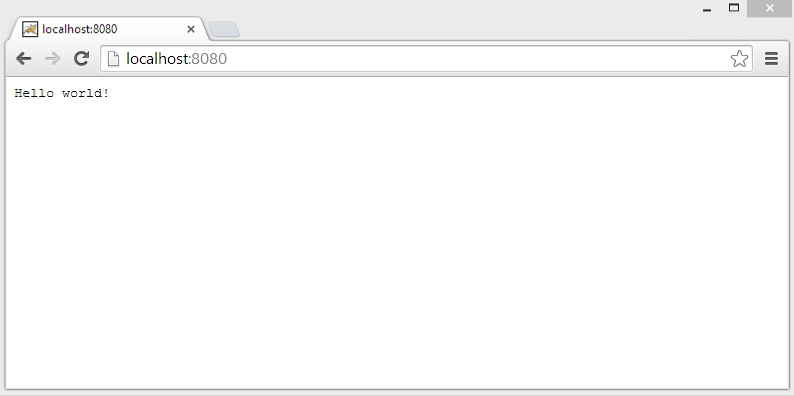

Congratulations! You have actually made a very simple Clojure app, and your computer is all set up to make more.


## Troubleshooting

  Students with Windows 7 may get the error below when they run `lein repl` for the first time.

  ```
  Address family not supported by protocol family: connect
  ```

  If the error message is this, look at <http://stackoverflow.com/a/21383865>.


  This error happens because `lein` command couldn't download necessary stuffs
  because a program called Relevant Knowledge, some sort of spyware, blocks the traffic.
  To solve this problem, uninstall Relevant Knowledge.
  This requires users' (owner's or administrator's) password.
  Sometimes, attendees haven't heard of such permission stuff.
  Be ready for that.
