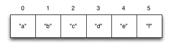

{::options parse_block_html="true" /}
<section>
Data Structures
----------------------------------------
{: .slide-title .chapter}

* Collections
    * Vectors
</section>

<section>
## Collections
{: .slide_title .slide}

#### Group of data <button class="link" ng-model="block11" ng-click="block11=!block11">Details</button>

> So far, we've dealt with discrete pieces of data: one number, one
string, one value. When programming, it is more often the case that
you want to work with groups of data.
{: ng-show="block11" .description}

#### Clojure and collections <button class="link" ng-model="block12" ng-click="block12=!block12">Details</button>

> Clojure has great facilities for working with these groups, or
_collections_, of data. Not only does it provide four different types
of collections, but it also provides a uniform way to use all of these
collections together.
{: ng-show="block12" .description}
</section>

<section>
## Vectors
{: .slide_title .slide}

#### Sequential collection <button class="link" ng-model="block21" ng-click="block21=!block21">Details</button>

> Vectors are sequential collections of data. You could say they are
lists of data, but we also have another collection called a list. If
you have programmed in another language, these might have been
called arrays in that language.
{: ng-show="block21" .description}

#### Compartments like structure <button class="link" ng-model="block22" ng-click="block22=!block22">Details</button>

> To imagine a vector, imagine a box split into some number of
> equally-sized compartments. Each of those compartments has a number.
> You can put a piece of data inside each compartment and always know
> where to find it, as it has a number.
{: ng-show="block22" .description}

> Note that the numbers start with 0. That may seem strange, but we
> often count from zero when programming.
{: ng-show="block22" .description}



</section>

<section>
#### Syntax <button class="link" ng-model="block31" ng-click="block31=!block31">Details</button>

>Vectors are written using square brackets with any number of pieces
>of data inside them, separated by spaces. Here are some examples of
>vectors:
{: ng-show="block31" .description}

```clojure
[1 2 3 4 5]
[56.9 60.2 61.8 63.1 54.3 66.4 66.5 68.1 70.2 69.2 63.1 57.1]
[]
```
</section>

<section>
### Usage examples
{: .slide_title .slide}

#### <button class="link" ng-model="block41" ng-click="block41=!block41">Intro</button>

> What can you do with vectors? Vectors are easy to add more items to,
> delete items from, or pull arbitrary items out of.
> Let's look at functions that operate on vectors together.
{: ng-show="block41" .description}
</section>

<section>
#### Type test <button class="link" ng-model="block51" ng-click="block51=!block51">Details</button>

> First, you see a function called `vector?`; this tells us whether
> the argument is a vector. Notice that it has a question mark at the
> end of it. We often call functions like these _predicate functions_,
> and they answer true-or-false questions about the data we give them.
{: ng-show="block51" .description}

```clojure
(vector? [5 10 15])
;=> true
```
</section>

<section>
#### Creation <button class="link" ng-model="block61" ng-click="block61=!block61">Details</button>

> The next two functions are used to make new vectors. The `vector`
> function takes any number of items and puts them in a new vector.
> `conj` is an interesting function that you'll see used with all the
> data structures. With vectors, it takes a vector and an item and
> returns a new vector with that item added to the end of the vector.
> Why the name `conj`? The verb "conjugate" has an archaic meaning "to
> join together," which is what we're doing: we're joining the new
> item to the vector.
{: ng-show="block61" .description}

```clojure
(vector 5 10 15)
;=> [5 10 15]

(conj [5 10] 15)
;=> [5 10 15]
```
</section>

<section>
#### Creation and Immutability <button class="link" ng-model="block71" ng-click="block71=!block71">Details</button>

> If you've programmed in another language before, you might be
> wondering if `conj` changes the vector. It's important to note that
> it does not. All collections in Clojure are _immutable_--that is,
> unchangeable. When we say that a function "adds to" or "removes
> from" a collection, what we mean is that the function returns a new
> collection with an item added or removed.
{: ng-show="block71" .description}

```clojure
(def v (vector 5 10))
v
;=> [5 10]
(conj v 15)
;=> [5 10 15]
v
;=> [5 10]
```
</section>

<section>
#### Extraction <button class="link" ng-model="block81" ng-click="block81=!block81">Details</button>

> Now, take a look at these four functions. `count` gives us a
count of the number of items in a vector. `nth` gives us the nth
item in the vector. Note that we start counting at 0, so in the
example, calling `nth` with the number 1 gives us what we'd call the
second element when we aren't programming. `first` returns the first
item in the collection. `rest` returns all except the frist item.
Try not to think about that and `nth` at the same time, as they can
be confusing.
{: ng-show="block81" .description}

```clojure
(count [5 10 15])
;=> 3
(nth [5 10 15] 1)
;=> 10
(first [5 10 15])
;=> 5
(rest [5 10 15])
;=> (10 15)
```
</section>

<section>
### EXERCISE: Make a vector
{: .slide_title .slide}

* Make a vector of the high temperatues for the next 7 days in the
  town where you live.
* Then use the `nth` function to get the high temperature for next
  Tuesday.

</section>
