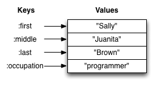

{::options parse_block_html="true" /}
<section>
More Data Structures
----------------------------------------
{: .slide-title .chapter}

* Keywords and Maps
* Collections of Collections
</section>

<section>
## Keywords
{: .slide_title .slide}

#### one of value types <button class="link" ng-model="block11" ng-click="block11=!block11">Details</button>

> Keywords are the strangest of the basic value types, because they
> don't have a real world analog like numbers, strings, and booleans
> do. You can think of them as a special type of string, one that's
> used for labels. They are often used as keys for maps.
{: ng-show="block11" .description}

```clojure
:first
:last
```
</section>

<section>
## Maps

#### key value pairs <button class="link" ng-model="block21" ng-click="block21=!block21">Details</button>

>Maps hold a set of keys and values associated with them. You can
>think of it like a dictionary: you look up things using a word (a
>keyword) and see the definition (its value). If you've programmed in
>another language, you might have seen something like maps--maybe
>called dictionaries, hashes, or associative arrays.
{: ng-show="block21" .description}


</section>

<section>
#### Syntax <button class="link" ng-model="block31" ng-click="block31=!block31">Details</button>

> We write maps by enclosing alternating keys and values in curly braces, like so.
{: ng-show="block31" .description}

> Maps are useful because they can hold data in a way we normally
> think about it. Take our made up example, Sally Brown. A map can
> hold her first name and last name, her address, her favorite food,
> or anything else. It's a simple way to collect that data and make it
> easy to look up. The last example is an empty map. It is a map that
> is ready to hold some things, but doesn't have anything in it yet.
{: ng-show="block31" .description}

```clojure
{:first "Sally" :last "Brown"}
{:a 1 :b "two"}
{}
```

</section>

<section>
### Usage Examples
{: .slide_title .slide}

#### <button class="link" ng-model="block41" ng-click="block41=!block41">Intro</button>

> Let's look at some functions we can use with maps. We don't have
> nearly as many functions here in common as vectors and lists did.
{: ng-show="block41" .description}

#### Type test <button class="link" ng-model="block42" ng-click="block42=!block42">Details</button>

> `map?` determines if the thing passed to it is a map and returns
> true or false
{: ng-show="block42" .description}

```clojure
(map? {:first "Sally" :last "Brown"})
;=> true
```
</section>

<section>
#### Creation <button class="link" ng-model="block51" ng-click="block51=!block51">Details</button>

> `assoc` and `dissoc` are paired functions: they associate and disassociate items from a map. See how we add the last name "Brown" to the map with `assoc`, and then we remove it with `dissoc`. `merge` merges two maps together to make a new map.
{: ng-show="block51" .description}

```clojure
(assoc {:first "Sally"} :last "Brown")
;=> {:first "Sally", :last "Brown"}

(dissoc {:first "Sally" :last "Brown"} :last)
;=> {:first "Sally"}

(merge {:first "Sally"} {:last "Brown"})
;=> {:first "Sally" :last "Brown"}
```
</section>

<section>
#### Extraction <button class="link" ng-model="block61" ng-click="block61=!block61">Details</button>

> `get` works a lot like `nth` did with vectors, but takes a key
> instead of a number. It uses the supplied key to look up a value in
> the map. What do you think is happening with the second example of
> `get`? We can supply a value for `get` to return if it can't find
> the key we asked for. In this case, we supplied the key `:MISS`.
{: ng-show="block61" .description}

```clojure
(get {:first "Sally" :last "Brown"} :first)
;=> "Sally"

(get {:first "Sally"} :last :MISS)
;=> :MISS
```
</section>


<section>
#### Extraction 2 <button class="link" ng-model="block71" ng-click="block71=!block71">Details</button>

> `count`, every collection has this function. Why do you think the
> answer is two? `count` is returning the number of associations.
{: ng-show="block71" .description}

```clojure
(count {:first "Sally" :last "Brown"})
;=> 2
```
</section>

<section>
#### Extraction 3 <button class="link" ng-model="block81" ng-click="block81=!block81">Details</button>

> Then we have `keys` and `vals`, which are pretty simple: they return
> the keys and values in the map. The order is not guaranteed, so we
> could have gotten `(:first :last)` or `(:last :first)`.
{: ng-show="block81" .description}

```clojure
(keys {:first "Sally" :last "Brown"})
;=> (:first :last)

(vals {:first "Sally" :last "Brown"})
;=> ("Sally" "Brown")
```
</section>

<section>
#### Extraction 4 <button class="link" ng-model="block91" ng-click="block91=!block91">Details</button>

> Let's look at one more thing about maps before we move on. You can
> always use `get` to get values out of maps, but you'll more often see
> something like the following:
{: ng-show="block91" .description}

> You can use a keyword like you would use a function in order to look
> up values in a map. Feel free to use `get` in your own code: it can
> be more clear and less confusing as you're learning Clojure.
{: ng-show="block91" .description}

```clojure
(:first {:first "Sally" :last "Brown"})
;=> "Sally"
(:last {:first "Sally"})
;=> nil
(:last {:first "Sally"} :MISS)
;=> :MISS
```
</section>

<section>
## Collections of Collections

#### <button class="link" ng-model="block101" ng-click="block101=!block101">Intro</button>

> Simple values such as numbers, keywords, and strings are not the
> only types of things you can put into collections. You can also put
> other collections into collections, so you can have a vector of
> maps, or a list of vectors, or whatever combination fits your data.
{: ng-show="block101" .description}
</section>

<section>
### Vector of Maps

```clojure
(def friends [{:first "Bob"}{:first "Jane"}])

(first friends)
;=> {:first "Bob"}
```
</section>

<section>
### Map of Maps

```clojure
(def family {:brother {:first "Matt" :state "TX"}
             :sister1 {:first "Susan" :state "TN"}
             :sister2 {:first "Hannah" :state "IL"}})

(get family :brother)  => {:first "Matt" :state "TX"}
(:brother family)      => {:first "Matt" :state "TX"}

(get family :sister1)  => {:first "Susan" :state "TN"}
(:sister1 family)      => {:first "Susan" :state "TN"}
```
</section>

<section>
### EXERCISE 1: Modeling Yourself
{: .slide_title .slide}

* Make a map representing yourself.
* Make sure it contains your first name and last name.
* Then, add your hometown to the map using [assoc](http://grimoire.arrdem.com/1.6.0/clojure.core/assoc/) or [merge](http://grimoire.arrdem.com/1.6.0/clojure.core/merge/).
</section>

<section>
### EXERCISE 2: Get the names of people
{: .slide_title .slide}

* Create a function called `get-names` that takes a vector of maps of people and returns a vector of their names.

* Here is an example of how it should work:

```clojure
(get-names [{:first "Margaret" :last "Atwood"}
            {:first "Doris" :last "Lessing"}
            {:first "Ursula" :last "Le Guin"}
            {:first "Alice" :last "Munro"}])

;=> ["Margaret Atwood" "Doris Lessing" "Ursula Le Guin" "Alice Munro"]
```

* Hint: First, create a function that returns the name when given a single person's map. Consider using the function [Map](http://grimoire.arrdem.com/1.6.0/clojure.core/map/) (covered on [Functions](functions.md) to apply that function to each element in your list of maps).
</section>

<section>
### EXERCISE 3: Modeling your classmates
{: .slide_title .slide}

* First, take the map you made about yourself.

* Then, create a vector of maps containing the first name, last name and hometown of two or three other classmates around you.

* Lastly, add your map to their information using [conj](http://grimoire.arrdem.com/1.6.0/clojure.core/conj/).

* Use the `get-names` function from Exercise 2 to output a list of the names.
</section>
