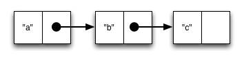

Data Structures
===============

* Collections
* Vectors
* Lists
* Maps
* Sequences

## Collections

So far, we've dealt with discrete pieces of data, one number, one string, one value. When programming, it is more often the case that you want to work with groups of data. Clojure has great facilities for working with these groups, or _collections_ of data. Not only does it provide four different types of collections, but it also provides a uniform way to use all of these collections together.


## Vectors

Vectors are sequential collections of data. You could say they are lists of data, but we also have another collection called a list. If you have programmed in another language, these might have been called arrays in that language.

Vectors are written using square brackets with any number of pieces of data inside them, separated by spaces. Here are some examples of vectors:

```clj
[1 2 3 4 5]
["a" 1 2 "b"]
[]
```

What can you do with vectors? Vectors are easily to add more items to, delete items from, or pull arbitrary items out of. Here are some functions that operate on vectors.

```clj
(vector? [:a :b :c])
;=> true

(sequential? [:a :b :c])
;=> true

(associative? [:a :b :c])
;=> true

(vector :a :b :c)
;=> [:a :b :c]

(conj [:a :b] :c)
;=> [:a :b :c]

(count [:a :b :c])
;=> 3

(nth [:a :b :c] 1)
;=> :b

(first [:a :b :c])
;=> :a
```

Let's look at these functions together. First, you see a function called `vector?`. You can probably guess what that does: it tells us whether the argument is a vector. `sequential?` and `associative?` also have question marks at the end of them. We often all functions like these _predicate functions_, and they answer some true-or-false question about the data we give them. `sequential?` lets us know if this collection lets us store and access things sequentially (it does.) `associative?` is a little harder. It lets us know whether we can look up values in this collection using keys. We can with a vector: each item in the vector has a key starting with zero and going up that points to it. In our vector `[:a :b :c]`, the key 0 points to `:a`, the key 1 points to `:b`, and the key 2 points to `:c`.

The next two functions are used to make new vectors. The `vector` function takes any number of items and puts them in a new vector. `conj` is an interesting function that you'll see used with all the data structures. With vectors, it takes a vector and an item and returns a new vector with that item added to the end of the vector. Why the name `conj`? The verb "conjugate" has an archaic meaning to join together, which is what we're doing: we're joining the new item to the vector.

If you've programmed in another language before, you might be wondering if `conj` changes the vector. It's important to note that it does not. All collections in Clojure are _immutable_: that is, unchangable. When we say that a function "adds to" or "removes from" a collection, what we mean is that the function returns a new collection with an item added or removed.

Take a look at the last three functions. `count` does what you'd expect: gives us a count of the number of items in a vector. `nth` gives us the nth item in the vector. Note that we start counting at 0, so in the example, calling `nth` with the number 1 gives us what we'd call the second element when we aren't programming. `first` returns the first item in the collection. Try not to think about that and `nth` at the same time or your brain will fry.


### EXERCISE: Make a vector

Make a vector of all the places you've ever lived. Then use the `nth` function to get the current place you live from the vector.


## Lists

Lists look a lot like vectors, but they work differently. It's easiest to imagine a list as a chain of items. Each item has a value stored in it, but it also has a link to the next item in the chain.



We write lists by calling the function `list` with the items we want in the list afterwards. Here are some examples:

```clj
(list :a :b)
(list "a" 1 2 3 "b")
(list)
```

Note that the last example there is an empty list.

What can you do with lists? You'll usually use a vector to store a collection of data (I want to say "list" here, but that's super-confusing.) Sometimes, though, you want a collection that you can quickly add and remove the head of. Think of a list like this as a stack of something -- coins, plates, books, whatever. It's easy to add to the top or take stuff off the top. Can you see why it'd be hard to remove things from the bottom of a list?

Here are some functions that operate on lists:

```clj
(list? (list 1 2 3))
; => true

(sequential? (list 1 2 3))
; => true

(associative? (list 1 2 3))
; => false

(list 1 2 3)
; => (1 2 3)

(conj (list 1 2) 3)
; => (3 1 2)

(count (list 1 2 3))
; => 3

(first (list 1 2 3))
; => 1

(rest (list 1 2 3))
; => (2 3)
```

A lot of these are the same as you saw with vectors. Let's talk about what's different. Look at the `associative?` function. This time it's false. Can you guess why? In a list, we don't have keys to look stuff up by. If you want an item from a list, you have to take items off the top until you get what you're looking for.

You can use `conj` with lists, too. What's different from when we use it with vectors? New items get added to the head of the list. `conj` works with all the data structure we're going to cover, but it doesn't promise where it will add the new item: that's specific to the type of data structure.

Lastly, there's a function here we didn't see before: `rest`. `rest` removes the head from the list and returns the rest, usually called the "tail."


## Maps

Maps hold a set of keys and values associated with them. You can think of it like a dictionary: you look up things using a word (a key) and see the definition (that is, the value.) If you've programmed in another language, you might have seen something like maps, maybe called dictionaries, hashes, or associative arrays.

We write maps by enclosing alternating keys and values in curly braces, like so:

```clj
{:first "Sally", :last "Brown"}
{:a 1 :b "two"}
{}
```

Maps are useful because they can hold data in a way we normally think about it. Take our made up example, Sally Brown. A map can hold her first name and last name, her address, her favorite food, or anything else. It's a simple way to collect that data and make it easy to look up. That last example? It is an empty map. It is a map that is ready to hold some things, but doesn't have anything in it yet.

Let's look at some functions we can use with maps:

```clj
(map? {:first "Sally" :last "Brown"})
;=> true

(sequential? {:first "Sally" :last "Brown"})
;=> false

(associative? {:first "Sally" :last "Brown"})
;=> true

(get {:first "Sally" :last "Brown"} :first)
;=> "Sally"

(get {:first "Sally"} :last :MISS)
=> :MISS

(assoc {:first "Sally"} :last "Brown")
;=> {:first "Sally", :last "Brown"}

(dissoc {:first "Sally" :last "Brown"} :last)
;=> {:first "Sally"}

(merge {:first "Sally"} {:last "Brown"})
;=> {:first "Sally", :last "Brown"}

(count {:first "Sally" :last "Brown"})
;=> 2

(keys {:first "Sally" :last "Brown"})
;=> (:first :last)

(vals {:first "Sally" :last "Brown"})
;=> ("Sally" "Brown")

(into {} [[1 2] [3 4]])
;=> {1 2, 3 4}
```

We don't have nearly as many functions here in common as vectors and lists did. We still have `sequential?` and `associative?` to tell us what our collections are like. Note that `sequential?` is now false: maps don't hold things in a certain order.

`get` works a lot like `nth` did with vectors, but takes a key instead of a number. It uses the supplied key to look up a value in the map. What do you think is happening with the second example of `get`? We can supply a value for `get` to return if it can't find the key we asked for. In this case, we supplied the key `:MISS`.

`assoc` and `dissoc` are paired functions: they associate and disassociate items from a map. See how we add the last name "Brown" to the map with `assoc`, and then we remove it with `dissoc`. `merge` merges two maps together to make a new map.

We have `count`, like we have with every collection. Why do you think the answer is two? `count` is returning the number of associations.

Then we have `keys` and `vals`, which are pretty simple: they return the keys and values in the map. The order is not guaranteed, so we could have gotten `(:first :last)` or `(:last :first)`.

The last one - into - works with any kind of collection. It takes everything from one collection and puts it into another one, so it's useful for converting from one type of collection to another.

Let's look at one more thing about maps before we move on. You can always use `get` to get values out of maps, but you'll more often see something like the following:

```clj
(:first {:first "Sally" :last "Brown"})
=> "Sally"
(:last {:first "Sally"})
=> nil
(:last {:first "Sally"} :MISS)
=> :MISS
```

You can use a keyword like you would use a function in order to look up values in a map. Feel free to use `get` in your own code: it can be more clear and less confusing as you're learning Clojure.


### EXERCISE: Modeling Yourself

Make a map representing yourself. Make sure it contains your first name and last name. Then, add your hometown to the map using `assoc` or `merge`.


## Sequences

The reason you see the same functions used on different types of collections is because they are all _sequences_. (Technically, they all provide access to their elements as a sequence. While this is an important distinction for advanced Clojure developers, the simpler way of talking about sequences is useful at this stage.) A sequence is a Clojure abstraction, a unified way to look at many different types of collections. The data structures you've seen so far -- vectors, lists, maps, and sets -- are not the only things to be represented as sequences. Many other things, such as lists of files, lines of text, or records in a database, can be represented as sequences, and so you can use all sequence functions with them.

Here is one example. The sequence function take makes a new sequence with the first so many items from a provided collection. 

```clj
(take 3 [1 2 3 4 5 6 7 8])
;=> (1 2 3) 
```

We will see many other functions that can be used with sequences as we move forward.


## Collections of Collections

Simple values such as numbers, keywords, and strings are not the only things you can put into a collection. You can also put other collections into collections, so you can have a vector of maps, or a list of vectors, or whatever combination fits your data.


### EXERCISE: Modeling your classmates

First, take the map you made about yourself.

Then, find two or three other classmates around you. Ask them their first and last name and their hometown. Make a vector of maps with their information.

Lastly, add your information to their information using `conj`.
