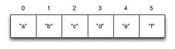

Data Structures
===============

* Collections
* Vectors

## Collections

So far, we've dealt with discrete pieces of data: one number, one string, one value. When programming, it is more often the case that you want to work with groups of data. Clojure has great facilities for working with these groups, or _collections_, of data. Not only does it provide four different types of collections, but it also provides a uniform way to use all of these collections together.


## Vectors

Vectors are sequential collections of data. You could say they are lists of data, but we also have another collection called a list. If you have programmed in another language, these might have been called arrays in that language.

To imagine a vector, imagine a box split into some number of equally-sized compartments. Each of those compartments has a number. You can put a piece of data inside each compartment and always know where to find it, as it has a number.



Note that the numbers start with 0. That may seem strange, but we often count from zero when programming.

Vectors are written using square brackets with any number of pieces of data inside them, separated by spaces. Here are some examples of vectors:

```clj
[1 2 3 4 5]
["a" 1 2 "b"]
[]
```

What can you do with vectors? Vectors are easy to add more items to, delete items from, or pull arbitrary items out of. Here are some functions that operate on vectors.

```clj
(vector? [:a :b :c])
;=> true

(vector :a :b :c)
;=> [:a :b :c]

(conj [:a :b] :c)
;=> [:a :b :c]

(count [:a :b :c])
;=> 3

(nth [:a :b :c] 1)
;=> :b

(first [:a :b :c])
;=> :a
```

Let's look at these functions together. First, you see a function called `vector?`. You can probably guess what that does: it tells us whether the argument is a vector. Notice that it has a question mark at the end of it. We often call functions like these _predicate functions_, and they answer true-or-false questions about the data we give them.

The next two functions are used to make new vectors. The `vector` function takes any number of items and puts them in a new vector. `conj` is an interesting function that you'll see used with all the data structures. With vectors, it takes a vector and an item and returns a new vector with that item added to the end of the vector. Why the name `conj`? The verb "conjugate" has an archaic meaning "to join together," which is what we're doing: we're joining the new item to the vector.

If you've programmed in another language before, you might be wondering if `conj` changes the vector. It's important to note that it does not. All collections in Clojure are _immutable_--that is, unchangeable. When we say that a function "adds to" or "removes from" a collection, what we mean is that the function returns a new collection with an item added or removed.

Now, take a look at the last three functions. `count` does what you'd expect: it gives us a count of the number of items in a vector. `nth` gives us the nth item in the vector. Note that we start counting at 0, so in the example, calling `nth` with the number 1 gives us what we'd call the second element when we aren't programming. `first` returns the first item in the collection. Try not to think about that and `nth` at the same time or your brain will fry.


### EXERCISE: Make a vector

Make a vector of all the places you've ever lived. Then use the `nth` function to get the current place you live from the vector.