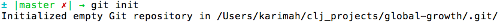
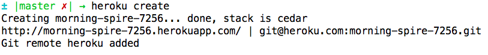

Putting Your Application Online
===============================

What is deployment?
-----------------
Your app is live. Great! But right now, it runs on your local machine only. If you want others to see and use it, you'll need to deploy it. The quickest way to deploy your app is to push it to Heroku using Git.

Deploying to Heroku
-----------------
1. First, make sure you're in the global-growth directory. (<code>cd global-growth</code> if necessary.) Now run <code>git init</code> to create an empty Git repository.

2. Heroku will receive only the files you have committed to your local repo, so it's time to add your files to Git and commit these changes to the repo you've just created.
Run <code>git status</code>. This command shows you the files you've modified but have yet to stage for a commit. Run the following commands to stage all your files and commit the corresponding changes:
	<pre><code>git add .
git commit -m "[Your commit message here]"</code></pre>
Your commit message should refer to the changes you've made. Something like "Add functions to retrieve indicator data" would work.

3. As you did in the [setup steps](https://github.com/ClojureBridge/curriculum/blob/master/outline/setup_osx.md), run <code>heroku create</code>. You'll see something like this:

4. Push your changes to Heroku by running <code>git push heroku master</code>. This command takes all the changes you've committed locally and pushes them to Heroku.

5. Run <code>heroku open</code>. Your application should open in your browser. If that doesn't happen, open a browser and go to the URL displayed after you ran <code>heroku create</code>. Profit!