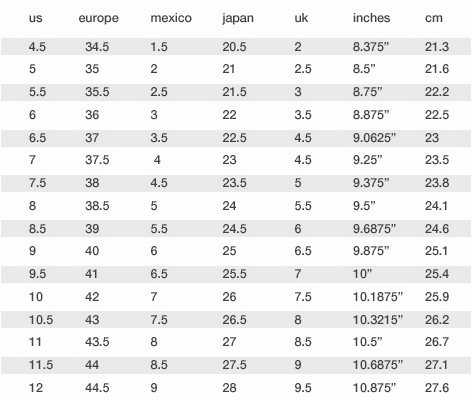

{::options parse_block_html="true" /}



http://clojurebridge.github.io/curriculum/outline/flow_control.html



<section>
Flow Control
-------------------------
{: .slide-title .chapter}

* `if`
* `cond`
* Boolean logic
</section>

<section>
### What is flow control?
{: .slide_title .slide}

#### Decisions how to react <button class="link" ng-model="block11" ng-click="block11=!block11">Details</button>

> "Flow control" is the programming term for deciding how to react to
> a given circumstance. We make decisions like this all the time. *If*
> it's a nice day out, *then* we should visit the park; *otherwise* we
> should stay inside and play board games. *If* your car's tank is
> empty, *then* you should visit a gas station; *otherwise* you should
> continue to your destination.
{: ng-show="block11" .description}

#### Testing conditions to react <button class="link" ng-model="block12" ng-click="block12=!block12">Details</button>

> Software is also full of these decisions. *If* the user's input is
> valid, *then* we should save her data; *otherwise* we show an error
> message. The common pattern here is that you test some condition and
> react differently based on whether the condition is *true* or *false*.
{: ng-show="block12" .description}
</section>

<section>
### `if`
{: .slide_title .slide}

#### <button class="link" ng-model="block21" ng-click="block21=!block21">Details</button>

> In Clojure, the most basic tool we have for the flow control is the `if`
> operator. Here's the example how you might code the data validation scenario.
>
> If the `angle` is less than 360, then return `angle`; otherwise,
> calculate modulo by 360 and return it. (because 370 degrees = 10 degrees)
{: ng-show="block21" .description}

> Reference: [Conditional `if`](http://clojurebridge.github.io/community-docs/docs/clojure/if/)
{: ng-show="block21" .description}

```clojure
(if (< angle 360)
  angle
  (mod angle 360))
```
</section>

<section>
#### General form of `if` operator

```clojure
(if conditional-expression
  expression-to-evaluate-when-true
  expression-to-evaluate-when-false)
```
</section>

<section>
#### `if` examples

```clojure
(if (> 3 1)
  "3 is greater than 1"
  "3 is not greater than 1")
;=> "3 is greater than 1"

(if (> 1 3)
  "1 is greater than 3"
  "1 is not greater than 3")
  ;=> "1 is not greater than 3"
```
</section>

<section>
#### Truthiness <button class="link" ng-model="block51" ng-click="block51=!block51">Details</button>

> When testing the truth of an expression, Clojure considers the
> values `nil` and `false` to be false and everything else to be true.
> Here are some examples:
{: ng-show="block51" .description}

> Reference: [Truthiness](http://clojurebridge.github.io/community-docs/docs/clojure/truthiness/)
{: ng-show="block51" .description}


```clojure
(if "anything other than nil or false is considered true"
  "A string is considered true"
  "A string is not considered true")
;=> "A string is considered true"

(if nil
  "nil is considered true"
  "nil is not considered true")
;=> "nil is not considered true"

(if (get {:a 1} :b)
  "expressions which evaluate to nil are considered true"
  "expressions which evaluate to nil are not considered true")
;=> "expressions which evaluate to nil are not considered true"
```
</section>

<section>
#### EXERCISE: Real angle calculator
{: .slide_title .slide}

* Write a function `real-angle` that takes an angle as an argument.
* You may use if example in the slide.
* The function should return a real-angle between 0 to 359

    - See: [angle in absolute degrees](https://github.com/ClojureBridge/welcometoclojurebridge/blob/master/outline/TURTLE.md#angle-in-absolute-degrees)

```clojure
;; if example
(if (< angle 360)
  angle
  (mod angle 360))
```

```clojure
;; usage of real-angle function
(real-angle 180)
;=> 180
(real-angle 1000)
;=> 280
```
</section>

<section>
### `cond`
{: .slide_title .slide}

<button class="link" ng-model="block61" ng-click="block61=!block61">Details1</button>
<button class="link" ng-model="block62" ng-click="block62=!block62">Details2</button>

> The `if` operator takes only one predicate.
> When we want to use multiple predicates, `if` is not a good option.
> We have to write nested, nested, ... and nested `if` conditions.
> To branch to multiple situations, `cond` operator works well.
{: ng-show="block61" .description}

> Here's the example. If temp is greater than 65 (in Fahrenheit),
> evaluate the first form. If temp is greater than 45, evaluate the
> second form. If both two predicates return false, evaluate the
> `:else` form.
{: ng-show="block62" .description}

> Reference: [Conditional `cond`](http://clojurebridge.github.io/community-docs/docs/clojure/cond/)
{: ng-show="block62" .description}

```clojure
(cond
  (> temp 65) "I'll enjoy walking at a park."
  (> temp 45) "I'll spend time at a cafe."
  :else "I'll curl up in my bed."))
```
</section>

<section>
#### General form of `cond` operator

```clojure
(cond
  predicate1 expression-to-evaluate-when-predicate1-is-true
  predicate2 expression-to-evaluate-when-predicate2-is-true
  ...
  :else expression-to-evaluate-when-all-above-are-false)
```
</section>

<section>
#### EXERCISE [BONUS]: Shoe Size Mapping
{: .slide_title .slide}

|Suppose you are traveling abroad..<br/> (chart: www.jcpenney.com )| |

1. pick up some of sets from the table, for example, us 6 and 9
2. write mapping using `cond` (us 6 -> less than or equal to euro 36)
3. write a function, for example, `us-to-euro` with one argument
4. use `cond` you wrote at step 2 to complete the function
</section>

<section>
### Boolean logic with `and`, `or`, and `not`
{: .slide_title .slide}

#### <button class="link" ng-model="block81" ng-click="block81=!block81">Intro</button>

> `if` statements are not limited to testing only one thing. You can
> test multiple conditions using boolean logic. _Boolean logic_ refers
> to combining and changing the results of predicates using `and`,
> `or`, and `not`.
{: ng-show="block81" .description}

> If you've never seen this concept in programming before, remember
> that it follows the common sense way you look at things normally. Is
> this _and_ that true? Only if both are true. Is this _or_ that true?
> Yes, if either -- or both! -- are. Is this _not_ true? Yes, if it's
> false.
{: ng-show="block81" .description}
</section>

<section>
### Truthy and falsey table <button class="link" ng-model="block91" ng-click="block91=!block91">Details</button>

> `and`, `or`, and `not` work like other functions (they aren't
> exactly functions, but work like them), so they are in _prefix
> notation_, like we've seen with arithmetic.
{: ng-show="block91" .description}

| x     | y     | (`and` x y) | (`or` x y) | (`not` x) | (`not` y) |
| ----- | ----- | --------- | -------- | ------- | ------- |
| false | false | false | false | true  | true  |
| true  | false | false | true  | false | true  |
| true  | true  | true  | true  | false | false |
| false | true  | false | true  | true  | false |

</section>

<section>
#### `and`, `or`, and `not` combination <button class="link" ng-model="block101" ng-click="block101=!block101">Details</button>

> `and`, `or`, and `not` can be combined. This can be hard to read.
> Here's an example:
{: ng-show="block101" .description}

```clojure
(defn leap-year?
  "Every four years, except years divisible by 100, but yes for years divisible by 400."
  [year]
  (and (zero? (mod year 4))
       (or (zero? (mod year 400))
           (not (zero? (mod year 100))))))
```
</section>



:star2: A link below is for a slide only. Go to [README.md](../README.md)
instead. :star2:



<section>
Return to the <a href="javascript:;" onClick="Reveal.slide(1);">first slide</a>,
or go to the [curriculum outline](/curriculum/#/1).
</section>
