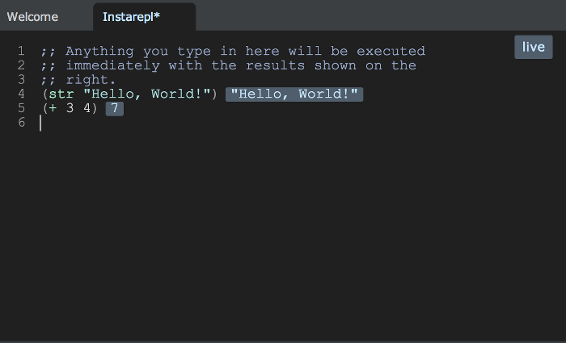

{::options parse_block_html="true" /}



http://clojurebridge.github.io/curriculum/outline/intro.html



<section>
Introduction to Programming with Clojure
----------------------------------------
{: .slide-title .chapter}

* Why Clojure?
* What is Clojure good at?
* What does Clojure look like?
    - Comments
* What is a REPL?
* REPL in action
</section>

<section>
## Why Clojure?
{: .slide_title .slide}

####  <button class="link" ng-model="block11" ng-click="block11=!block11">Intro</button>

> If you've never programmed before, you may not know that there are
> many languages to choose from. Some of the other languages you might
> have heard of (or will hear of!) are C, JavaScript, Python, and
> Java.
{: ng-show="block11" .description}

> So why are we teaching Clojure? Although it's not as popular as any
> of those languages, we're using Clojure because of three qualities
> it has that make it an ideal first language to learn--or a great
> language to learn in addition to others you might already know:
{: ng-show="block11" .description}

#### Clojure is _simple_ <button class="link" ng-model="block12" ng-click="block12=!block12">Details</button>

> Clojure is _simple_. That's not to say it's not powerful; it is. The
> number of concepts you have to know to program in Clojure is very
> small, however, and easy to grasp. Clojure grows with you as you
> learn it, and you can be very productive with a small subset of the
> language.
{: ng-show="block12" .description}

#### Clojure is _all-purpose_ <button class="link" ng-model="block13" ng-click="block13=!block13">Details</button>

> Clojure is _all-purpose_. Some languages have a specific focus.
> JavaScript, for example, was traditionally used only in web pages
> (although that's changed somewhat). Objective-C is used mainly for
> iPhone apps. We're going to make a drawing application today, but
> you can use Clojure for any sort of application easily.
{: ng-show="block13" .description}

#### Clojure is _fun_ <button class="link" ng-model="block14" ng-click="block14=!block14">Details</button>

> Clojure is _fun_. That's a matter of opinion, of course, but we
> think it holds true. I hope that during this course you experience
> the joy of seeing a Clojure program come together and do something
> powerful and surprising.
{: ng-show="block14" .description}
</section>

<section>
## What is Clojure good at?
{: .slide_title .slide}

#### <button class="link" ng-model="block21" ng-click="block21=!block21">Intro</button>

> So, we said Clojure is all-purpose, and it is. That doesn't mean it
> doesn't have strong suits, though.
{: ng-show="block21" .description}

#### Data processing <button class="link" ng-model="block22" ng-click="block22=!block22">Details</button>

> Clojure is known for being good at data processing. That's because
> it has a good set of data structures--that is, it has several
> built-in ways to represent data that are easy to use and powerful.
{: ng-show="block22" .description}

#### Concurrency <button class="link" ng-model="block23" ng-click="block23=!block23">Details</button>

> Clojure is known for its concurrency. Think about writing
> instructions for four of your friends about how to assemble a
> treehouse, but instead of writing them so one step is done at a
> time, each of your friends does part of the job. Then, they
> coordinate at the right time to assemble those parts into bigger
> parts, and they do this over and over again until the end, when it
> all comes together. Those instructions would be really complicated
> and hard to write--and probably hard to read, too. Clojure gives us
> some easy ways to write these sorts of instructions for computers.
{: ng-show="block23" .description}

#### Everything! <button class="link" ng-model="block24" ng-click="block24=!block24">Details</button>

> Clojure also works well for building drawing applications with
> [Quil](https://github.com/quil/quil), which is what we're going to
> do together.
{: ng-show="block24" .description}
</section>

<section>
## What does Clojure look like?
{: .slide_title .slide}

```clojure
(str "Hello, World!")
(+ 3 4)
(forward :trinity 40)
```

#### Parentheses <button class="link" ng-model="block31" ng-click="block31=!block31">Details</button>

> Notice the parentheses. Parentheses enclose instructions to the
> computer in Clojure. A left parenthesis
> is the start of the instruction, and a matching right parenthesis is
> the end of enclosing instruction. Normally, Clojure code has a lot
> of nested parentheses, on other words, nested enclosing instructions.
{: ng-show="block31" .description}

#### Functions <button class="link" ng-model="block32" ng-click="block32=!block32">Details</button>

> Next to the parentheses, we see the instructions to the
> computer. That instruction is normally what we call a _function_.
> The functions do all the hard work in Clojure.
> `str`, `+` and `forward` are all functions.
> When these functions get run, they return a some type of value.
> Clojure functions always return a value.
{: ng-show="block32" .description}

#### Arguments <button class="link" ng-model="block33" ng-click="block33=!block33">Details</button>

> Many functions take in _arguments_--which are everything else inside
> the enclosing parentheses after the function--.
> `str` takes "Hello, World!" and returns a string.
> `+` takes 3 and 4, adds them, and returns 7.
> `forward` takes :trinity and 40, moves a turtle by 40 and returns
> the result.
{: ng-show="block33" .description}
</section>

<section>
### Comments

<button class="link" ng-model="block41" ng-click="block41=!block41">Details 1</button>
<button class="link" ng-model="block42" ng-click="block42=!block42">Details 2</button>

> When we write code, we try to make it as clear as possible. Doing so
> is a huge advantage because our code gets read by others (oftentimes
> more so than by us!), or we come back to our own code to read it
> later, by which point we may have forgotten each exact detail of the
> code. One way that we can clarify our code is annotating it with
> comments. Comments are notes that we add to code, for our own sake,
> that the computer ignores.
{: ng-show="block41" .description}

> In Clojure, comments can be started with a semicolon. Everything
> after a semicolon until the end of that line is a comment that gets
> ignored by the computer. Only one semicolon is necessary, but
> sometimes you see two semicolons in a row, depending on stylistic
> tastes.
{: ng-show="block42" .description}

> Reference: [Comment](http://clojurebridge.github.io/community-docs/docs/clojure/comment/)
{: ng-show="block42" .description}

```clojure
;; example functions from a previous slide
(str "Hello, World!")  ; a well-known hello world
(+ 3 4)                ; why not 3 + 4? figure out later
```
</section>

<section>
## What is a REPL?
{: .slide_title .slide}

#### <button class="link" ng-model="block51" ng-click="block51=!block51">Intro</button>

> "REPL" stands for "Read-Eval-Print-Loop," which still doesn't make a
> ton of sense without context. Many programming languages, including
> Clojure, have a way to execute code interactively so you get instant
> feedback. In other words, the code is read, then it is evaluated,
> then the result is printed, and you begin again--thus, a loop.
{: ng-show="block51" .description}

**R**ead, **E**val, **P**rint, **L**oop



</section>

<section>
## REPL in action
{: .slide_title .slide}

#### Light Table's REPL <button class="link" ng-model="block61" ng-click="block61=!block61">Details</button>

> Clojure has a REPL that you can run from the terminal easily, and
> we'll talk more about that later, but for now, let's use Light
> Table's REPL. It is a nice way to interact with Clojure from
> within Light Table.
{: ng-show="block61" .description}


#### insta-REPL <button class="link" ng-model="block62" ng-click="block62=!block62">Details</button>

> Let's begin with "insta-REPL."
> Start Light Table, go to the "View" menu and click "Commands."
> Notice that typing ctrl+space is another handy way.
> Type "insta" and press enter when the "Instarepl:
> Open a Clojure instarepl" choice is highlighted.
{: ng-show="block62" .description}

> When you hit enter, you should see a message about "connecting" or
> "retrieving deps." Wait for the instarepl to finish connecting
> before typing anything.
{: ng-show="block62" .description}


#### Evaluate file and line <button class="link" ng-model="block63" ng-click="block63=!block63">Details</button>

> Also, Light Table give us a way to evaluate Clojure program file and a
> single line of Clojure program.
> Open the file
> `welcometoclojurebridge/src/clojurebridge_turtle/walk.clj`.
> Hit <kbd>Ctrl</kbd> + <kbd>Shift</kbd> + <kbd>Enter</kbd> or
> <kbd>Cmd</kbd> + <kbd>Shift</kbd> + <kbd>Enter</kbd> to evaluate the
> file. Hit <kbd>Ctrl</kbd> + <kbd>Enter</kbd> or <kbd>Cmd</kbd> +
> <kbd>Enter</kbd> to evaluate each line.
{: ng-show="block63" .description}
</section>

<section>
#### EXERCISE 1: Try insta-REPL

* Start Light Table
* Open instarepl
* Type Clojure functions below and see what happens

```clojure
(str "Hello, World!")
(str "Hello, World!" " " "from Clojure")
(+ 3 4)
(- 3 4)
(* 3 4)
```
> You might see an error in red while typing. This happens
> because Light Table is continually evaluating what you are typing,
> and before you finish, the code might not be valid.
</section>

<section>
#### EXERCISE 2: Evaluate file and line

* Open the file `welcometoclojurebridge/src/clojurebridge_turtle/walk.clj`
* Evaluate the file and see what happens
* Type `(forward 40)` and evaluate this line
* See what happens
* Type `(right 90)` or other commands and evaluate the lines one by one
* Take a look [Turtles App API](https://github.com/ClojureBridge/welcometoclojurebridge/blob/master/outline/TURTLE.md) and
[How To Walk Turtles](https://github.com/ClojureBridge/welcometoclojurebridge/blob/master/outline/TURTLE-SAMPLES.md)
[section 1 and 2], and try more commands to walk your turtle
</section>

<section>
#### EXERCISE 3: Look at Clojure docs

* Go to either of `insta-REPL` or `walk.clj` file
* Move your cursor to the end of any function name, for example `+`
or `forward`
* Right click and select "Show docs"
* See the document appears on the Light Table
* Check your cursor is still at the end of the function name
* Right click and select "Show docs"
* See the document disappears
</section>



:star2: A link below is for a slide only. Go to [README.md](../README.md)
instead. :star2:



<section>
Return to the <a href="javascript:;" onClick="Reveal.slide(1);">first slide</a>,
or go to the [curriculum outline](/curriculum/#/1).
</section>
