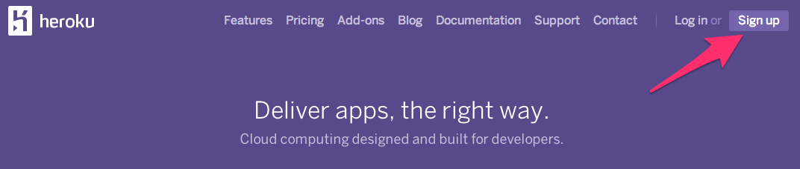
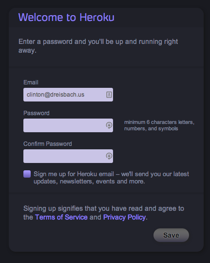

Getting Set Up
==============

* Get Leiningen installed
* Get LightTable installed
* Get Heroku installed (includes Git)
* Test installation

## Requirements

Everyone in the workshop should have a laptop. If it is running Windows, it should be running Windows 7 or above. If it is running OS X, it should be running 10.7 or above. If it is running Linux, you are probably fine.

If anyone attending does not have access to a laptop running one of the above choices, let the instructors know. You can either pair with someone else, or we can provide a virtual machine that you can run if you have a laptop.

## Installing Leiningen

Leiningen is a tool used on the command line to manage Clojure projects. Its installation instructions are different depending on your operating system.

### Linux

Ok, smarty-pants. Make sure you have Java installed, then go to [the Leiningen website](http://leiningen.org) and read the instructions. You know what you are doing. Help everyone around you.

### OS X

First, make sure you have Java installed. Open Terminal.app (which can be found under /Applications/Utilities). Run `java -version` in your terminal. If you do not have Java installed, this will prompt you to install it.

You will need your terminal for the rest of this install, so keep it open.

#### Homebrew

If you already have [Homebrew](http://brew.sh/) installed, you are in luck! Run the following commands in your terminal:

    brew update
    brew install leiningen

Now help everyone else out!

If you do not have Homebrew installed, do not attempt to install it for this program.

#### Everyone else

Go to the [Leiningen website](http://leiningen.org/). You will see a link to the `lein` script under "Install." Right-click that link and choose "Save Link As...". Save it in your Downloads directory.

After that, type the following commands in your terminal. You will be prompted to enter your password.

```
sudo mv ~/Downloads/lein /usr/local/bin/lein
sudo chmod a+x /usr/local/bin/lein
```

#### Testing

Everyone, Homebrew and non-Homebrew alike, should do the next step. Open up Terminal.app, and run the `lein` command. It should take a while to run, as it will download some resources it needs the first time. If it completes succesfully, you are golden! If not, ask an instructor for help.

### Windows

**NOTE**: These instructions are written for Windows 7. They _should_ work on Windows 8, but have not been vetted yet.

Go to [the Leiningen Windows installer site](http://leiningen-win-installer.djpowell.net/). You should see two links, one for installing Java and another for "leiningen-win-installer." First, click the Java link. Then, you should see a screen like the following:


Click the button above "Java Platform (JDK)," as you can see in the above picture. Then you will come to a page that will have the following table on it:


Click the radio button to accept the license agreement, and then download one of the two Windows choices. If you are running 32-bit Windows, choose "Windows x86." If you are running 64-bit Windows, choose "Windows x64." If you do not know, find your "My Computer" icon and right-click it. Choose "Properties." You should see a window like the following:


You should see if you are running 32- or 64-bit Windows beside "System Type."

Once you have downloaded the right Java version, run the executable you downloaded to install Java. Follow the prompts.

Next, go back to the Leiningen Windows installer site and download the file linked as "leiningen-win-installer." Run this executable and follow the "Detailed installation" section at the Leiningen Windows Installer site. At the end of the installation, leave "Run a Clojure REPL" checked before you click "Finish." If a terminal window opens that looks like the one on the Leiningen Windows installer site, then you are good to go.

## Installing LightTable

First, go to the [LightTable site](http://www.lighttable.com/). On the page there, you should see a set of buttons that have download links for LightTable for your operating system. Again, if you are running Linux, you know which to download and you can figure it out.


### OS X

If you are running OS X, click the "OS X 10.7+" button and you will download a .zip file. Click the downloaded file (it should be in your Downloads folder and be named LightTableMac.zip) to unzip it. Once unzipped, move LightTable.app to your Applications folder.

### Windows

If you are running Windows, click the "Win" button and you will download a .zip file. Unzip this file (either by finding it in your Downloads folder and double-clicking it, or by choosing "Open" when downloading.) Inside the .zip file, there is a a directory called "LightTable". Drag this to your desktop. (If you know what you are doing and want this somewhere else, that is fine.)

Inside the LightTable directory, there is an application called LightTable. You may want to right-click it and choose "Pin to Start Menu" or "Pin to Taskbar" so you can start it more quickly.

## Get setup with Heroku

Heroku is the tool we will use in order to put your application online where others can see it.

First, we need to create an account. Go to [Heroku](http://heroku.com) and click the "Sign up" link.



You will be taken to a form where you need to enter your email address in order to sign up. Fill out that form, and you will be sent an email with a link to click to continue the signup process.


After clicking on the link, you will be taken to another form where you will need to choose a password. Choose one and enter it twice.



After all that, you should be at your Heroku dashboard. There will be a link on the dashboard to download the Heroku Toolbelt for your operating system. Download it now.


## OS X

On OS X, you will download a .pkg file. Click it to install the Heroku Toolbelt and follow all prompts from the installation program. You will need your password to complete installation. Once installation, go to your terminal and run the command `heroku login`. You will be prompted for your email and password on Heroku. If you enter them and the command ends successfully, congratulations!

## Windows

On Windows, you will download an .exe file. Run this executable to install the Heroku Toolbelt and follow all prompts from the installation wizard.

You will now need to open a command prompt. Look for "Command Prompt" in your Start menu, or search for "cmd". When you have started a command prompt, run the command `heroku login`. You will be prompted for your email and password on Heroku. If you enter them and the command ends successfully, congratulations!

