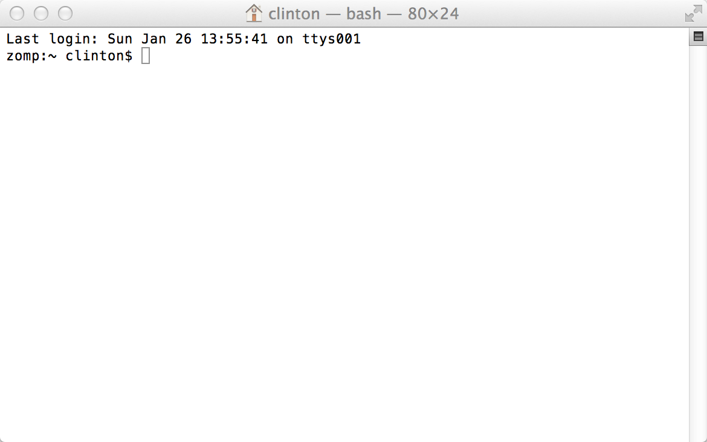
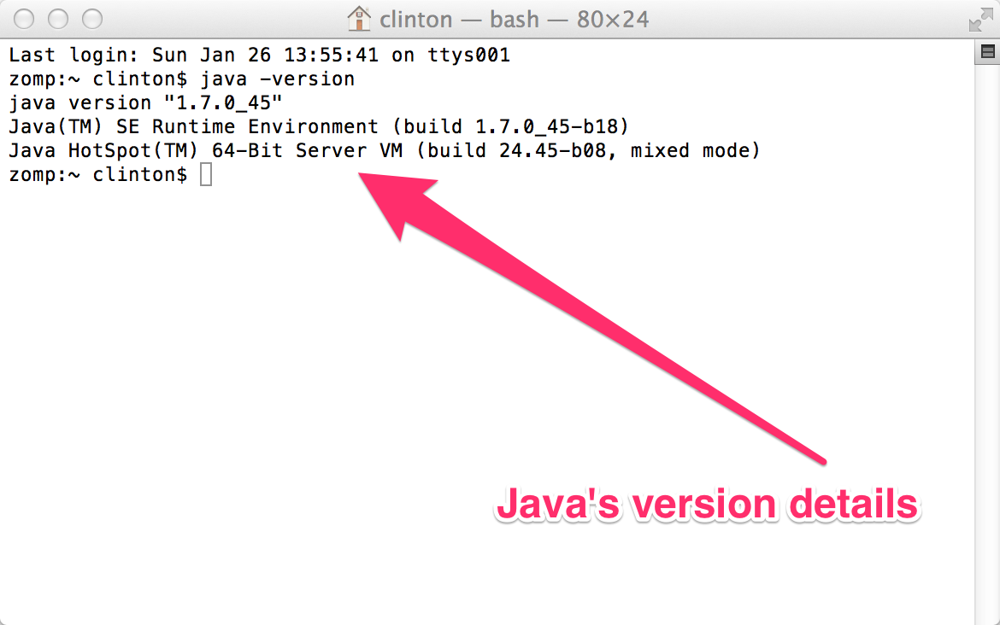
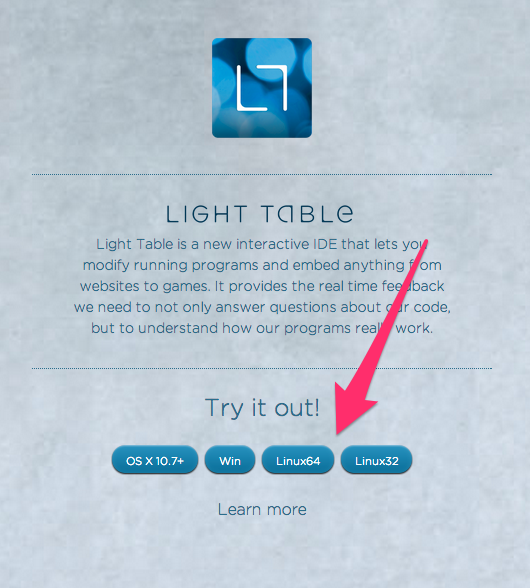
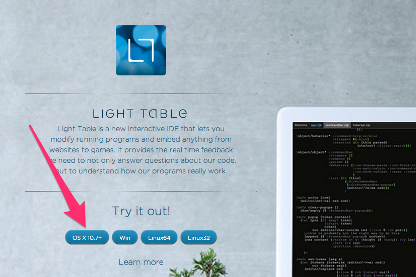
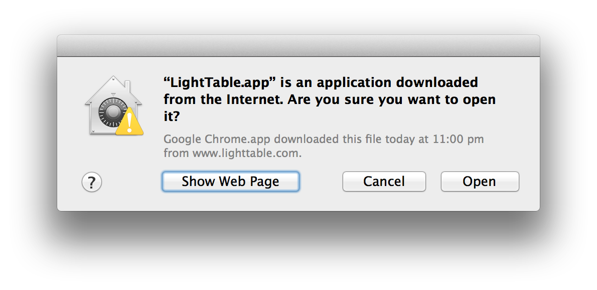
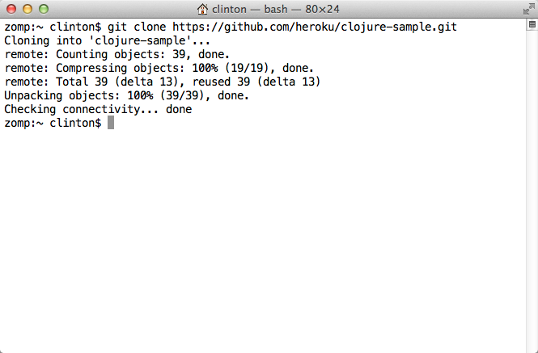
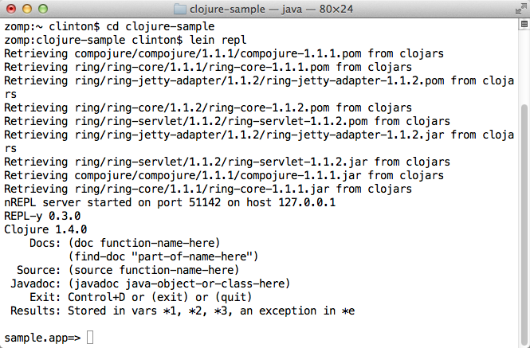
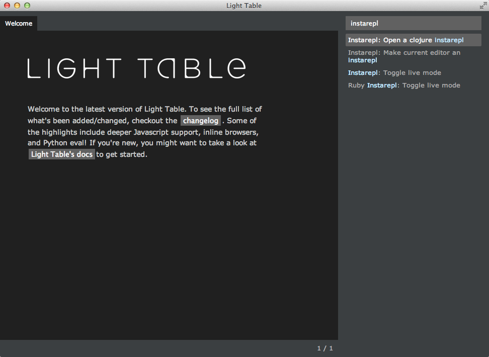
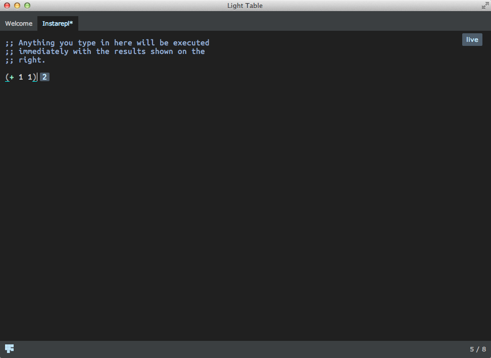

OS X Setup
==========

* Start a terminal
* Install Git
* Configure Git
* Make sure Java is installed
* Get Leiningen installed
* Get LightTable installed
* Test installation
* Troubleshooting
    - OS X 10.6.8
    - Yosemite

## Starting a terminal

For these instructions, and for much of the class, you will need to have a terminal, or command line, open. This is a text-based interface to talk to your computer, and you can open it by running Terminal.app, which is found under `/Applications/Utilities`. If you have never used the terminal before, you may want to spend some time [reading up on command-line basics](http://blog.teamtreehouse.com/command-line-basics).

Go ahead and open your terminal now. It should look something like this:



The prompt (where you will type your commands) may look different: it usually shows the computer name and user name, as well as the folder or directory you are currently in.

For the rest of this setup, I will tell you to run commands in your terminal. When I say that, I mean "type the command into the terminal and press the Return key."

## Install Git

To see if you have git installed type in: `git --version` If you have `git version 1.9.3 (Apple Git-50)` or above you should be fine.

If not, visit [git-scm.com](http://git-scm.com/). Click "Downloads for Mac". The Git installer may begin downloading automatically. If it does not, click the manual download link. Once the download has finished, open __~/Downloads__ in Finder and double-click the downloaded file (named something like __git-2.0.1-intel-universal-snow-leopard.dmg__). This will mount the disk image and open a new Finder window. Double-click the installer package (named something like __git-2.0.1-intel-universal-snow-leopard.pkg__). You may be told that the installer can't be opened because it is from an unidentified developer. If so, click "OK", then right-click (or control-click) the file and select "Open" from the contextual menu. You may be warned again that the installer is from an unidentified developer, but this time you'll have the option to click "Open". Do so. This will launch the installer. Follow its directions, and enter your password when prompted to do so. Once you have finished this process it's safe to unmount the disk image (by clicking the eject button in the Finder sidebar) and delete the file from the Downloads folder.

## Configure Git

If you've used Git before then you should already have user.name and user.email configured.
Otherwise, type this in the terminal:

```
git config --global user.name "Your Actual Name"
git config --global user.email "Your Actual Email"
```
TIP: Use the same email address for git, github, and ssh.

Verify by typing this in the terminal:

`git config --get user.name`
Expected result:
`your name`

`git config --get user.email`
Expected result:
`your email address`

## Making sure Java is installed

Run `java -version` in your terminal. If you do not have Java installed, OS X will prompt you to install it. Follow all of the directions OS X gives you, then return to this part of the tutorial and run `java -version` again.

If Java is installed, you will see something like this in your terminal:



The details of Java's version may differ from what you see above; that is perfectly fine.

## Installing Leiningen

Leiningen is a tool used on the command line to manage Clojure projects.

To install `lein`, execute the following commands in your terminal; you will be prompted to enter your password for at least the first command starting with `sudo` (The `%` character is a typical commandline prompt, don't type it):

```bash
% curl https://raw.githubusercontent.com/technomancy/leiningen/stable/bin/lein > lein
% sudo mkdir -p /usr/local/bin/
% sudo mv lein /usr/local/bin/lein
% sudo chmod a+x /usr/local/bin/lein
```
Check that you can now see the command:
```bash
% which lein
/usr/local/bin/lein
```
If you don't see `/usr/local/bin/lein` as above, do this next:
```bash
% export PATH=$PATH:/usr/local/bin
```
Now run `which lein` and you should see the `lein` command.

After you set up Leiningen as above, run the `lein version` command. This should take a while to run, as it will download some resources it needs the first time. If it completes successfully, you are golden! If not, ask an instructor for help.

## Installing Light Table

Go to the [LightTable site](http://www.lighttable.com/). On the page there, you should see a set of buttons that have download links for Light Table. Click the "OS X 10.7+" button and you will download a .zip file.




There should now be a file named LightTableMac.zip in your Downloads folder. Double-click the file to unzip it, then move LightTable.app to your Applications folder.

The first time you launch LightTable you will be presented with a confirmation
prompt. Click "Open".



### Opening files in LightTable from the command line *(optional)*

Run the following commands to create a "shortcut command" called `light-table`:

    echo "alias light-table='open -a /Applications/LightTable/LightTable.app'" >> ~/.bash_profile
    source ~/.bash_profile

You can now open files and folders in LightTable from the command line by entering `light-table path/to/the/file/you/want/to/open.clj`.

## Testing your setup

You have set up Java, Leiningen, LightTable, and Git on your computer--all the tools you will need for this course. Before starting, we need to test them out.

Go to your terminal and run the following command:

```
git clone https://github.com/ClojureBridge/welcometoclojurebridge
```

This will clone a sample Clojure application.



Then run the command:

```
cd welcometoclojurebridge
```

This will put you in the directory with the source code for this sample bit of Clojure code. After that completes, run:

```
lein repl
```

This could take a long time, and will download many other pieces of code it relies on. You should see lines that start with `Retrieving ...` on your screen. When it finishes, your terminal should look like the following:



This is starting a REPL, which we will learn about soon. It's a special terminal for Clojure. At the REPL prompt, type `(+ 1 1)` and press Return. Did you get the answer `2` back? You will learn more about that in the course. For now, press the Control button and D button on your keyboard together (abbreviated as Ctrl+D). This should take you out of the Clojure REPL and back to your normal terminal prompt. Then, the terminal will show you the following message: `sample.app=> Bye for now!`

Now, start Applications > LightTable. Once it is started, press the Control button and Space Bar together (abbreviated Ctrl+Space). This is how you start giving LightTable a command. Start typing the word "instarepl" and you should see a menu of options, like below. Choose "Instarepl: open a clojure instarepl."



At the bottom left of the screen, you will see a cube moving and some text about connecting, retrieving and installing dependencies. Wait until that stops moving, then type `(+ 1 1)` into the window. It should look like the following image:



If that worked, great!

Now we will open and run the sample Clojure app in LightTable. In LightTable, click on the menu "File" then choose "Open Folder." Find the directory you created earlier, `welcometoclojurebridge` and click "Upload." In the workspace menu on the left, click on welcometoclojurebridge - src - welcometoclojurebridge - core.clj. Double-click the core.clj file to open it. This is a Clojure program. Click on the file contents and press the following key combination:

<kbd>Cmd</kbd> + <kbd>Shift</kbd> + <kbd>Enter</kbd>

You should see a fun welcome message.

Congratulations! You have opened and run your first Clojure app, and your install and setup are complete!


## Troubleshooting

### OS X 10.6.8

Light Table actually does work on OS X 10.6.8. It thinks it does not. To convince it otherwise, do this:

  1. Use a text editor to open /Applications/LightTable.app/Contents/Info.plist
  2. Search for the key LSMinimumSystemVersion
  3. Remove that key from the file. Delete this entire text: LSMinimumSystemVersion 10.7.5
  4. Save the file, and you should be able to start Light Table.

### Yosemite

Yosemite was released after Light Table development was stalled.
Because of this historical reason, students may encounter troubles to start or use Light Table on Yosemite.
In such a case, [Nightcode](https://sekao.net/nightcode/) is another option.
See the instruction,
[Getting Started with Clojure using Nightcode](https://github.com/ClojureBridge/getting-started/blob/master/nightcode.md).
