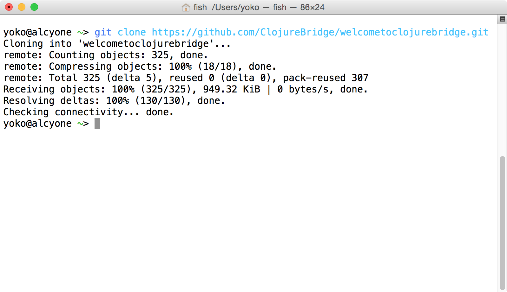
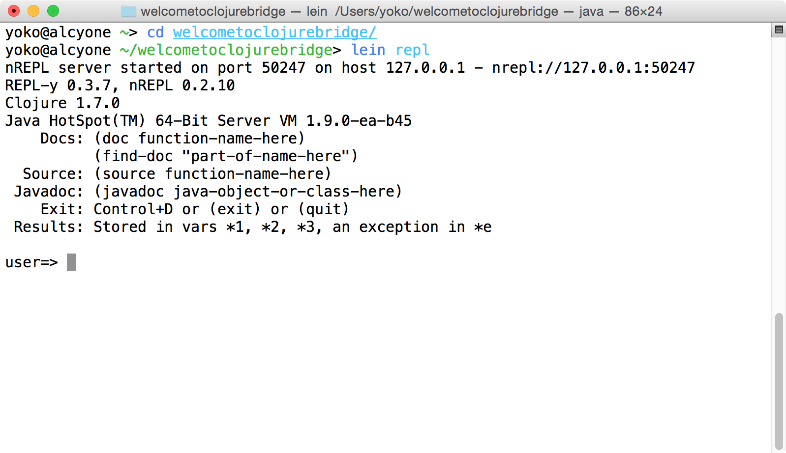
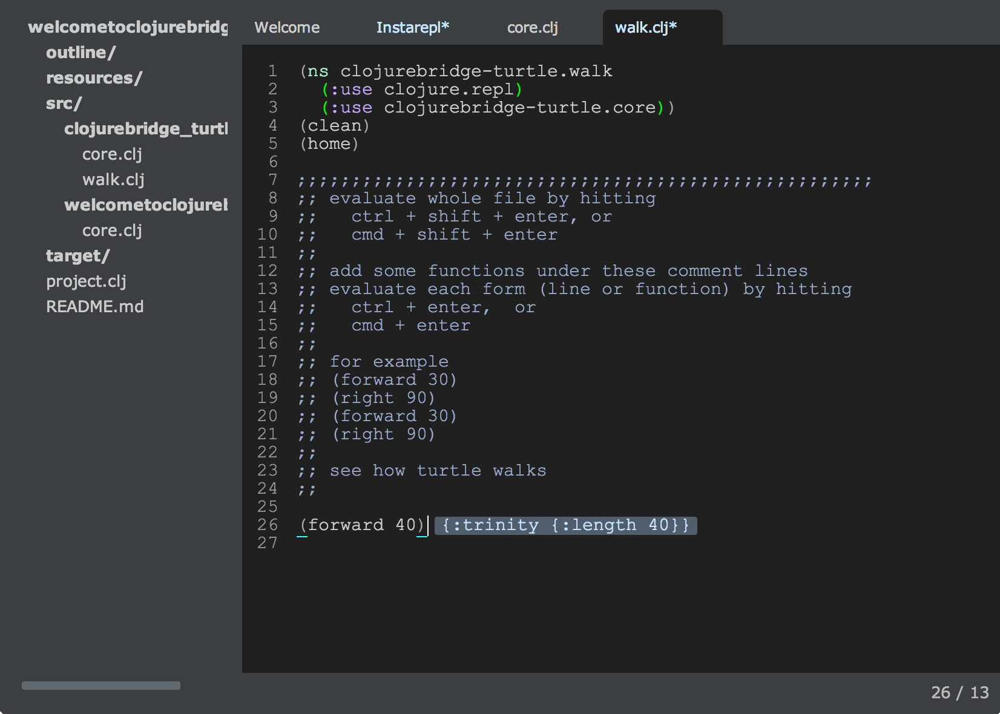

OS X Setup
==========

* Start a terminal
* Install Git
* Configure Git
* Make sure Java is installed
* Install Leiningen
* Install Light Table
* Test your setup
* Troubleshooting
    - OS X 10.6.8
    - Yosemite

## Starting a terminal

For these instructions, and for much of the class, you will need to have a terminal, or command line, open. This is a text-based interface to talk to your computer, and you can open it by running Terminal.app, which is found under `/Applications/Utilities`. If you have never used the terminal before, you may want to spend some time [reading up on command-line basics](http://blog.teamtreehouse.com/command-line-basics).

Go ahead and open your terminal now. It should look something like this:


The prompt (where you will type your commands) may look different: it usually shows the computer name and user name, as well as the folder or directory you are currently in.

For the rest of this setup, I will tell you to run commands in your terminal. When I say that, I mean "type the command into the terminal and press the Return key."

## Install Git

To see if you have git installed type in: `git --version` If you have `git version 1.9.3 (Apple Git-50)` or above you should be fine.

If not, visit [git-scm.com](http://git-scm.com/). Click "Downloads for Mac". The Git installer may begin downloading automatically. If it does not, click the manual download link. Once the download has finished, open __~/Downloads__ in Finder and double-click the downloaded file (named something like __git-2.0.1-intel-universal-snow-leopard.dmg__). This will mount the disk image and open a new Finder window. Double-click the installer package (named something like __git-2.0.1-intel-universal-snow-leopard.pkg__). You may be told that the installer can't be opened because it is from an unidentified developer. If so, click "OK", then right-click (or control-click) the file and select "Open" from the contextual menu. You may be warned again that the installer is from an unidentified developer, but this time you'll have the option to click "Open". Do so. This will launch the installer. Follow its directions, and enter your password when prompted to do so. Once you have finished this process it's safe to unmount the disk image (by clicking the eject button in the Finder sidebar) and delete the file from the Downloads folder.

## Configure Git

If you've used Git before then you should already have user.name and user.email configured.
Otherwise, type this in the terminal:

```bash
git config --global user.name "Your Actual Name"
git config --global user.email "Your Actual Email"
```
TIP: Use the same email address for git, github, and ssh.

Verify by typing this in the terminal:

`git config --get user.name`
Expected result:
`your name`

`git config --get user.email`
Expected result:
`your email address`

## Making sure Java is installed

> If you have OS X version 10.11 (El Capitan), you don't have Java installed.
> You need to install Java as well.
> Download Java from <http://www.oracle.com/technetwork/java/javase/downloads/jdk8-downloads-2133151.html> and follow the instruction. Once installation finishes, set `JAVA_HOME` environment variable on the terminal.
> `export JAVA_HOME=/usr/libexec/java_home -v 1.8`
>
> If you have a trouble, the article, <http://osxdaily.com/2015/10/17/how-to-install-java-in-os-x-el-capitan/>, may help.


Run `java -version` in your terminal. If you do not have Java installed, OS X will prompt you to install it (if your OS X is 10.10 or older). Follow all of the directions OS X gives you, then return to this part of the tutorial and run `java -version` again.

If Java is installed, you will see something like this in your terminal:


The details of Java's version may differ from what you see above; that is perfectly fine.

## Install Leiningen

Leiningen is a tool used on the command line to manage Clojure projects.

To install `lein`, execute the following commands in your terminal; you will be prompted to enter your password for at least the first command starting with `sudo` (The `%` character is a typical commandline prompt, don't type it):

```bash
% curl https://raw.githubusercontent.com/technomancy/leiningen/stable/bin/lein > lein
% sudo mkdir -p /usr/local/bin/
% sudo mv lein /usr/local/bin/lein
% sudo chmod a+x /usr/local/bin/lein
```
Check that you can now see the command:
```bash
% which lein
/usr/local/bin/lein
```
If you don't see `/usr/local/bin/lein` as above, do this next:
```bash
% export PATH=$PATH:/usr/local/bin
```
Now run `which lein` and you should see the `lein` command.

After you set up Leiningen as above, run the `lein version` command. This should take a while to run, as it will download some resources it needs the first time. If it completes successfully, you are golden! If not, ask an instructor for help.

## Install Light Table

Go to the [Light Table site](http://www.lighttable.com/). On the page there, you should see a set of buttons that have download links for Light Table. Click the "OS X 10.7+" button and you will download a .zip file.


There should now be a file named LightTableMac.zip in your Downloads folder. Double-click the file to unzip it, then move LightTable.app to your Applications folder.

The first time you launch Light Table you will be presented with a confirmation
prompt. Click "Open".


### Opening files in Light Table from the command line *(optional)*

Run the following commands to create a "shortcut command" called `light-table`:

    echo "alias light-table='open -a /Applications/LightTable/LightTable.app'" >> ~/.bash_profile
    source ~/.bash_profile

You can now open files and folders in Light Table from the command line by entering `light-table path/to/the/file/you/want/to/open.clj`.

## Test your setup

You have set up Java, Leiningen, Light Table, and Git on your computer--all the tools you will need for this workshop. Before starting, we need to test them out.

#### Cloning out github repository

Go to your terminal and run the following command:

```bash
git clone https://github.com/ClojureBridge/welcometoclojurebridge
```

This will clone `welcometoclojurebridge` repository which includes
sample Clojure apps.
Your terminal should look similar to this picture:



#### Testing `lein repl`

Then run the command:

```bash
cd welcometoclojurebridge
```

This will take you to the directory with the source code. After that completes, run:

```bash
lein repl
```

This could take a long time, and will download many other pieces of code apps rely on. You should see lines that start with `Retrieving ...` on your screen. When it finishes, your terminal should look like the following:



This is starting a REPL, which we will learn about soon. It's a special terminal for Clojure. At the REPL prompt, type `(+ 1 1)` and press Return. Did you get the answer `2` back? You will learn more about that in the course. For now, press the Control button and D button on your keyboard together (abbreviated as Ctrl+D). This should take you out of the Clojure REPL and back to your normal terminal prompt. Then, the terminal will show you the following message: `user=> Bye for now!`


#### Testing Light Table

Now we will open and run the sample Clojure apps in Light Table. Start LightTable from Applications > LightTable.

In Light Table, click on the menu "File" then choose "Open Folder." Find the
directory, `welcometoclojurebridge`, which was created when you ran
`git clone` command. Click "Upload." In the workspace menu on the
left, click on `welcometoclojurebridge` - `src` -
`welcometoclojurebridge` - `core.clj`. Double-click the `core.clj` file
to open it. This is a Clojure program.


Click on the file contents and
press the following key combination:

<kbd>Cmd</kbd> + <kbd>Shift</kbd> + <kbd>Enter</kbd>

You should see a fun welcome message.


Next, in the workspace menu on the left, click on
`welcometoclojurebridge` - `src` - `clojurebridge-turtle` -
`walk.clj`. Double-click the core.clj file to open it.


press the following key combination:

<kbd>Cmd</kbd> + <kbd>Shift</kbd> + <kbd>Enter</kbd>

An initial image of the turtles app will pop up.

Type `(forward 40)` at the end of the `walk.clj` and press the
following combination:

<kbd>Cmd</kbd> + <kbd>Enter</kbd>

You should see this on the Light Table:



also, your turtle should move.


#### Success!

Congratulations! You have opened and run your first Clojure apps, and
your install and setup are all completed!

## For convenience

### automatic closing of parentesses

[Enabling auto-closing parens.](http://stackoverflow.com/questions/27818505/light-table-parentheses-are-not-auto-closing)
__This has been disabled, because it tends to break with none english kayboard layouts!__
But if you use the EN layout you should be fine.

Quote from the link:
> What I needed to do was add this form to the User behaviors configuration:

> To do so, I followed these steps:

> * `Ctrl-Space` to open Commands
> * Type `user behaviors` and click the proposed command
> This open a file that you can edit to add
> `[:app :lt.objs.settings/pair-keymap-diffs]`


### show line numbers

To show line numbers:
* `Ctrl-Space` to open Commands
* Type `user behaviors` and click the proposed command
* This open a file that you can edit to add `[:editor :lt.objs.editor/line-numbers]`

### down wrap lines around

To not have lines wrap around if they are to long for the screen:
* `Ctrl-Space` to open Commands
* Type `user behaviors` and click the proposed command
* This open a file that you can edit to add `[:editor :lt.objs.editor/no-wrap]`

## Troubleshooting

### OS X 10.6.8

Light Table actually does work on OS X 10.6.8. It thinks it does not. To convince it otherwise, do this:

  1. Use a text editor to open /Applications/LightTable.app/Contents/Info.plist
  2. Search for the key LSMinimumSystemVersion
  3. Remove that key from the file. Delete this entire text: LSMinimumSystemVersion 10.7.5
  4. Save the file, and you should be able to start Light Table.

### Yosemite

Yosemite was released after Light Table development was stalled.
Because of this historical reason, students may encounter troubles to start or use Light Table on Yosemite.
In such a case, [Nightcode](https://sekao.net/nightcode/) is another option.
See the instruction,
[Getting Started with Clojure using Nightcode](https://github.com/ClojureBridge/getting-started/blob/master/nightcode.md).
