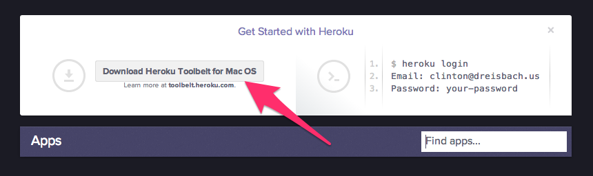
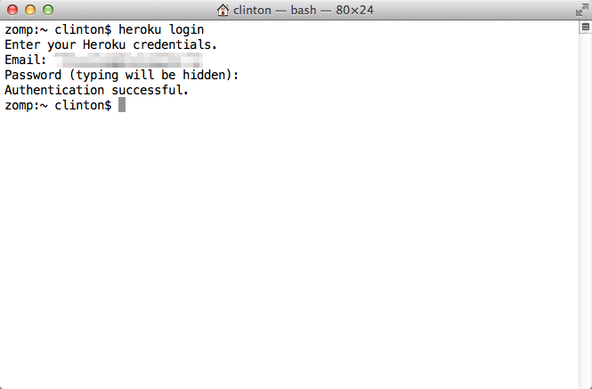
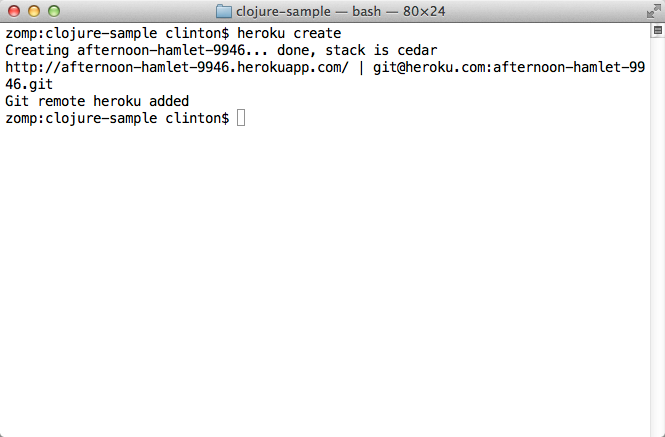
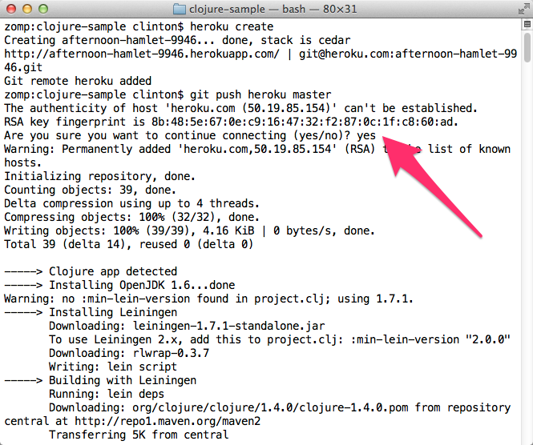
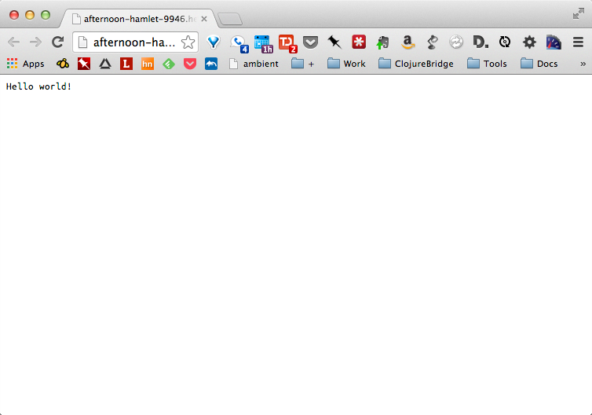

OS X Setup
==========

* Start a terminal
* Make sure Java is installed
* Get Leiningen installed
* Get Light Table installed
* Get Heroku installed (includes Git)
* Test installation

## Starting a terminal

For these instructions, and for much of the class, you will need to have a terminal, or command line, open. This is a text-based interface to talk to your computer, and you can open it by running Terminal.app, which is found under `/Applications/Utilities`. If you have never used the terminal before, you may want to spend some time [reading up on command-line basics](http://blog.teamtreehouse.com/command-line-basics).

Go ahead and open your terminal now. It should look something like this:


The prompt (where you will type your commands) may look different: it usually shows the computer name and user name, as well as the folder or directory you are currently in.

For the rest of this setup, I will tell you to run commands in your terminal. When I say that, I mean "type the command into the terminal and press the Return key."

## Making sure Java is installed

Run `java -version` in your terminal. If you do not have Java installed, OS X will prompt you to install it. Follow all of the directions OS X gives you, then return to this part of the tutorial and run `java -version` again.

If Java is installed, you will see something like this in your terminal:


The details of Java's version may differ from what you see above; that is perfectly fine.

## Installing Leiningen

Leiningen is a tool used on the command line to manage Clojure projects.

Go to the [Leiningen website](http://leiningen.org/). You will see a link to the `lein` script under "Install." Right-click that link and choose "Save Link As...". Save it in your Downloads directory.


After that, run the following commands in your terminal. You will be prompted to enter your password.

```
sudo mkdir -p /usr/local/bin/
sudo mv ~/Downloads/lein* /usr/local/bin/lein
sudo chmod a+x /usr/local/bin/lein
```

After you run the above commands, run the `lein version` command. It should take a while to run, as it will download some resources it needs the first time. If it completes successfully, you are golden! If not, ask an instructor for help.

## Installing Light Table

Go to the [Light Table site](http://www.lighttable.com/). On the page there, you should see a set of buttons that have download links for Light Table. Click the "OS X 10.7+" button and you will download a .zip file.


Unzip the downloaded file. It should be in your Downloads folder and be named LightTableMac.zip. Once unzipped, move LightTable.app to your Applications folder.

## Getting setup with Heroku

Heroku is the tool we will use in order to put your application online where others can see it.

First, we need to create an account. Go to [Heroku](http://heroku.com) and click the "Sign up" link.


You will be taken to a form where you need to enter your email address in order to sign up. Fill out that form, and you will be sent an email with a link to click to continue the signup process.


After clicking on the link, you will be taken to another form where you will need to choose a password. Choose one and enter it twice.


After all that, you should be at your Heroku dashboard. There will be a link on the dashboard to download the Heroku Toolbelt. Download it now.



If you do not see this link on your dashboard, you can download the toolbelt from [toolbelt.heroku.com](https://toolbelt.heroku.com/).

This will download a .pkg file. Click it to install the Heroku Toolbelt and follow all prompts from the installation wizard. You will need your OS X account password to complete installation. Once installation, go to your terminal and run the command `heroku login`. You will be prompted for your email and password on Heroku. If you enter them and the command ends successfully, congratulations!



## Testing your setup

You have set up Java, Leiningen, Light Table, Git, and Heroku on your computer, all the tools you will need for this course. Before starting, we need to test them out.

Go to your terminal and run the following command:

```
git clone https://github.com/heroku/clojure-sample.git
```

This will check out a sample Clojure application from GitHub, a central repository for lots of source code. Your terminal should look similar to this picture:


Then run the command:

```
cd clojure-sample
```

This will put you in the directory with the source code for this sample bit of Clojure code. After that completes, run:

```
lein repl
```

This could take a long time, and will download many other pieces of code it relies on. You should see lines that start with `Retrieving ...` on your screen. When it finishes, your terminal should look like the following:


This is starting a REPL, which we will learn about soon. It's a special terminal for Clojure. At the REPL prompt, type `(+ 1 1)` and press Return. Did you get the answer `2` back? You will learn more about that in the course. For now, press the Control button and D button on your keyboard together (abbreviated as Ctrl+D). This should take you out of the Clojure REPL and back to your normal terminal prompt.

Now, start Light Table. Once it is started, press the Control button and Space Bar together (abbreviated Ctrl+Space). This is how you start giving Light Table a command. Start typing the word "instarepl" and you should see a menu of options, like below. Choose "Instarepl: open a clojure instarepl."


At the bottom of the screen, you will see a cube moving and some text about connecting and installing dependencies. Once that stops moving, type `(+ 1 1)` into the window. It should look like the following image:


If that worked, great! Close Light Table. We only have one more thing to test, Heroku.

Go back to your terminal. You should still be in the `clojure-sample` directory.

Run this command:

`heroku create`

There should be output about something being created. A URL will be displayed. Look at the following example:



Next, run the following commands:

```
git push heroku master
heroku open
```

Enter "yes" if you are asked if you are sure you want to connect, like in the following image:



Your browser should open (and take a long time to load), and you should see a website like the following:



If your browser does not open after running `heroku open`, start a browser and go to the URL displayed after you ran `heroku create`.

Congratulations! That website is running code you have on your computer that you have uploaded. You have actually made a very simple Clojure app, and your computer is all set up to make more.
