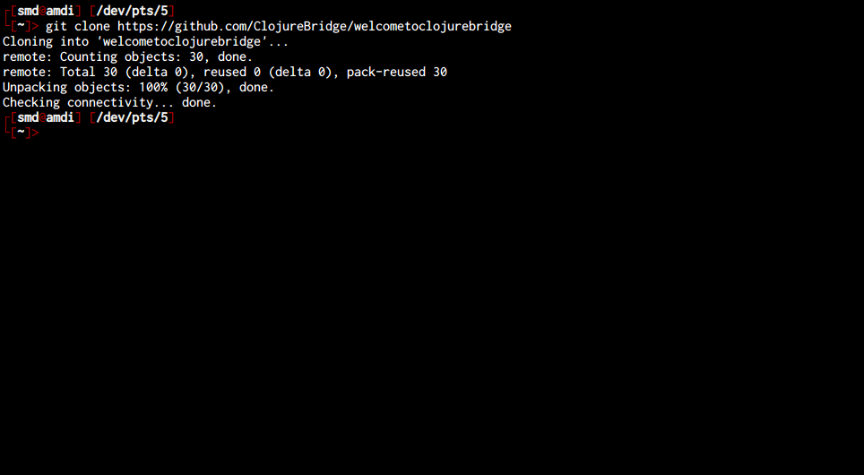
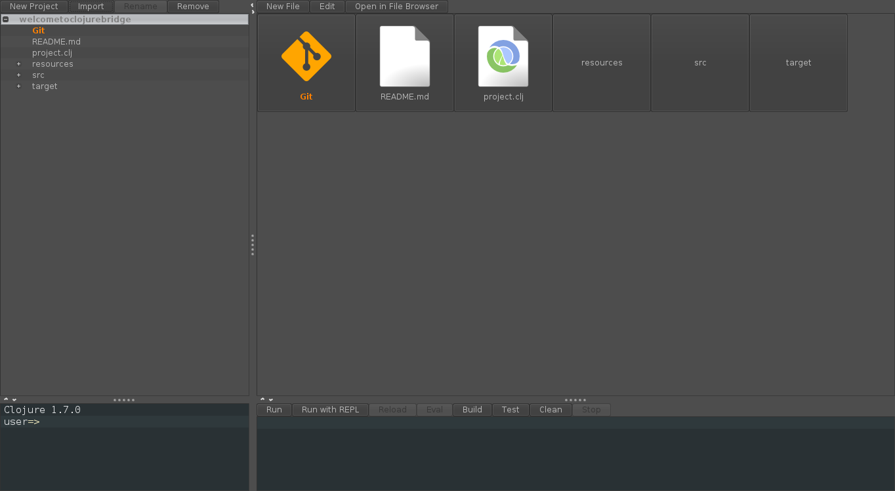

Ubuntu Setup
==========

* Start a terminal
* Make sure Java is installed
* Get Leiningen installed
* Get Nightcode installed
* Get Git installed
* Test installation

## Starting a terminal

For these instructions, and for much of the class, you will need to have a terminal, or command line, open. This is a text-based interface to talk to your computer, and you can open it by clicking "Dash Home" and typing `Terminal`. You can also open a terminal at any time by pressing `Ctrl-Alt-t`. If you have never used the terminal before, you may want to spend some time [reading up on command-line basics](http://blog.teamtreehouse.com/command-line-basics).

Go ahead and open your terminal now. It should look something like this:


The prompt (where you will type your commands) may look different: it usually shows the computer name and user name, as well as the folder or directory you are currently in.

For the rest of this setup, I will tell you to run commands in your terminal. When I say that, I mean "type the command into the terminal and press the Return key."

## Making sure Java is installed

Run `java -version` in your terminal. If you do not have Java installed, Ubuntu will prompt you to install it. It should look something like this:


Follow all of the directions Ubuntu gives you, selecting the package "openjdk-7-jre" then return to this part of the tutorial and run `java -version` again.

If Java is installed, you will see something like this in your terminal:


The details of Java's version may differ from what you see above; that is perfectly fine.

## Installing Leiningen

Leiningen is a tool used on the command line to manage Clojure projects.

Go to the [Leiningen website](http://leiningen.org/). You will see a link to the `lein` script under the "Install" heading. Right-click that link and choose "Save Link As...". Save it in your Downloads directory.


After that, run the following commands in your terminal. You will be prompted to enter your password.

```
sudo mkdir -p /usr/local/bin/
sudo mv ~/Downloads/lein* /usr/local/bin/lein
sudo chmod a+x /usr/local/bin/lein
export PATH=$PATH:/usr/local/bin
```

After you run the above commands, run the `lein version` command. It should take a while to run, as it will download some resources it needs the first time. If it completes successfully, you are golden! If not, ask an instructor for help.

## Installing Nightcode

Go to the [Nightcode site](https://sekao.net/nightcode/). On the page there, click the "Free Download" link and you will download a .jar file. There should now be a file named `nightcode-0.4.7-standalone.jar` in your Downloads folder. If Java is installed, you can double click the JAR file to run it.

The first time you launch Nightcode it will look like this:


## Installing Git

See if you already have Git installed with `git version`.
If the `git` command is not found, install it with this command in the terminal:

`sudo apt-get install git`

If you've used Git before then you should already have user.name and user.email configured.
Otherwise, type this in the terminal:

```
git config --global user.name "Your Actual Name"
git config --global user.email "Your Actual Email"
```
TIP: Use the same email address for git, github, and ssh.

Verify by typing this in the terminal:

`git config --get user.name`
Expected result:
`your name`

`git config --get user.email`
Expected result:
`your email address`

## Testing your setup

You have set up Java, Leiningen, Nightcode, and Git on your computer--all the tools you will need for this course. Before starting, we need to test them out.

Go to your terminal and run the following command:

```
git clone https://github.com/ClojureBridge/welcometoclojurebridge
```

This will clone a sample Clojure application.



Then run the command:

```
cd welcometoclojurebridge
```

This will put you in the directory with the source code for this sample bit of Clojure code. After that completes, run:

```
lein repl
```

This could take a long time, and will download many other pieces of code it relies on. You should see lines that start with `Retrieving ...` on your screen. When it finishes, your terminal should look like the following:


This is starting a REPL, which we will learn about soon. It's a special terminal for Clojure. At the REPL prompt, type `(+ 1 1)` and press Return. Did you get the answer `2` back? You will learn more about that in the course. For now, press the Control button and d button on your keyboard together (abbreviated as Ctrl-d). This should take you out of the Clojure REPL and back to your normal terminal prompt. Then, the terminal will show you the following message: `user=> Bye for now!`

Now we will open and run the sample Clojure app in Nightcode. Start Nightcode, and once it is started, click the "Import" button. Find the directory you created earlier, `welcometoclojurebridge` and click "Open."



In the workspace menu on the left, click on welcometoclojurebridge - src - welcometoclojurebridge - core.clj. Double-click the core.clj file to open it. This is a Clojure program.


Click on the file contents and press the "Run with REPL" button. It should look something like this:


Once the REPL is loaded, press the "Reload" button to run the code. Nightcode will load the program and you should see a fun welcome message.

Congratulations! You have opened and run your first Clojure app, and your install and setup are complete!
