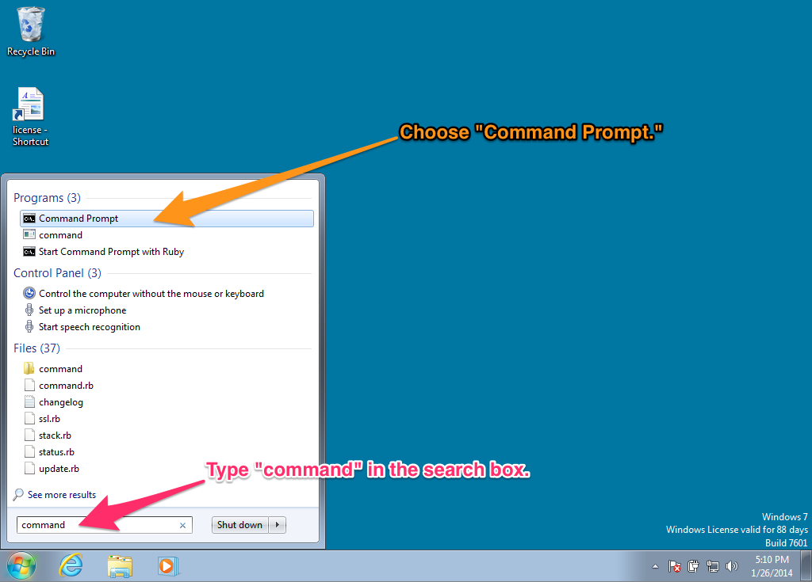
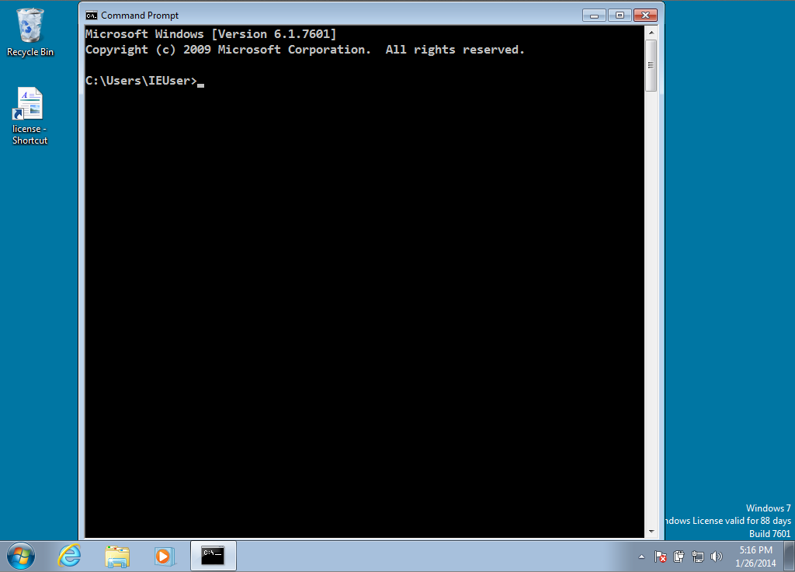
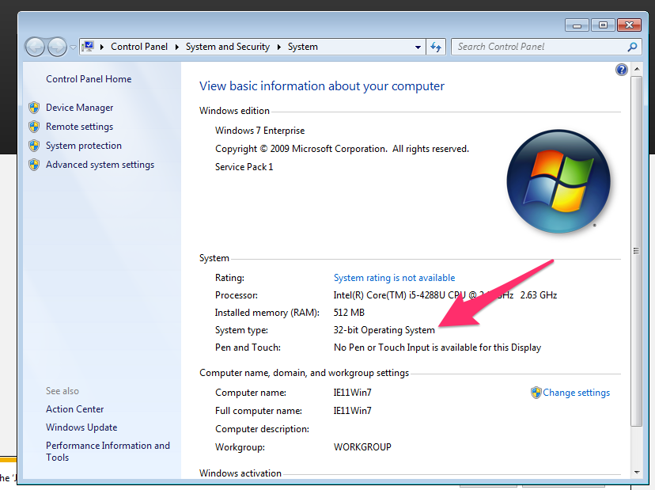
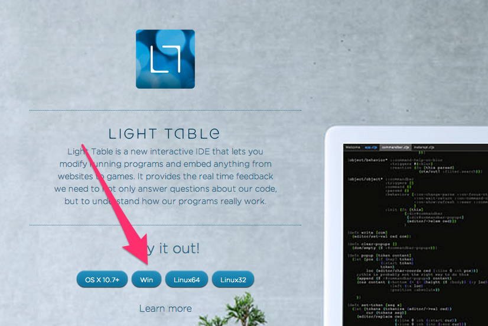

Windows 7 Setup
===============

* Start a command prompt
* Get Java installed
* Get Leiningen installed
* Get Light Table installed
* Get Heroku installed (includes Git)
* Test installation

## Starting a command prompt

For these instructions, and for much of the class, you will need to
have a command prompt open. This is a text-based interface to talk to
your computer. Go to the Start Menu and type "command" in the search
box. Choose the "Command Prompt" program, like in this screenshot:

When you choose "Command Prompt," your screen should look similar to
this:

If you have never used the command prompt before, you may want to
spend some time [reading up on command prompt
basics](http://dosprompt.info/). For the rest of this setup, I will
tell you to run commands in your command prompt. When I say that, I
mean "type the command into the command prompt and press the Return
key."

On other operating systems, the command prompt is called the
terminal. We will use the terms terminal, command prompt, and command
line interchangably.

## Installing Java

Go to [the Leiningen Windows installer
site](http://leiningen-win-installer.djpowell.net/). You should see
two links, one for installing Java and another for
"leiningen-win-installer." Click the Java link. Then, you should see a
screen like the following:

Click the button above "Java Platform (JDK)," as you can see in the
above picture. Then you will come to a page that will have the
following table on it:

Click the radio button to accept the license agreement, and then
download one of the two Windows choices. If you are running 32-bit
Windows, choose "Windows x86." If you are running 64-bit Windows,
choose "Windows x64."

If you do not know if you are running 32-bit or 64-bit Windows, go to
the Control Panel (Start Menu - Control Panel) and choose "System and
Security" and then "System." You should see a window like the
following:

You should see if you are running 32- or 64-bit Windows beside "System
Type."

Once you have downloaded the right Java version, run the executable
you downloaded to install Java. Follow the installation wizard.

## Installing Leiningen

Leiningen is a tool used on the command line to manage Clojure
projects.

Next, go back to [the Leiningen Windows installer
site](http://leiningen-win-installer.djpowell.net/) and download the
file linked as "leiningen-win-installer." Run this executable and
follow the "Detailed installation" section at the Leiningen Windows
Installer site. At the end of the installation, leave "Run a Clojure
REPL" checked before you click "Finish." If a terminal window opens
that looks like the one on the Leiningen Windows installer site, then
you are good to go.

## Installing Light Table

Go to the [Light Table site](http://www.lighttable.com/). On the page
there, you should see a set of buttons that have download links for
Light Table. Click the "Win" button and you will download a .zip file.

Unzip this file (either by finding it in your Downloads folder and
double-clicking it, or by choosing "Open" when downloading.) Inside
the .zip file, there is a a directory called "Light Table". Drag this
to your desktop. (If you know what you are doing and want this
somewhere else, that is fine.)

Inside the Light Table directory, there is an application called Light
Table. Right-click it and choose "Pin to Start Menu" so you can start
it more quickly.
