Windows 8 Setup
===============

* Start a command prompt
* Install Git
* Configure Git
* Install Java
* Install Leiningen
* Install Nightcode
* Test your setup
* Troubleshooting

## Starting a command prompt

For these instructions, and for much of the class, you will need to have a command prompt open. This is a text-based interface to talk to your computer. Go to the "Windows" screen (the "Start Screen") and type "command". Choose the "Command Prompt" program, like in this screenshot:

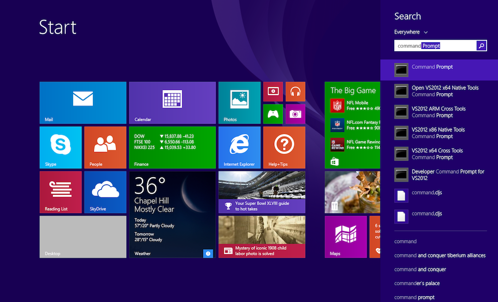

When you choose "Command Prompt," your screen should look similar to this:

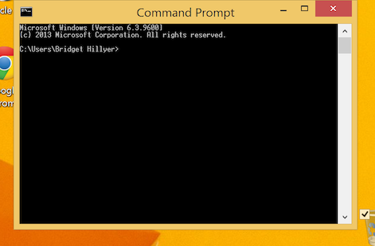

If you have never used the command prompt before, you may want to spend some time [reading up on command prompt basics](http://dosprompt.info/). For the rest of this setup, I will tell you to run commands in your command prompt. When I say that, I mean "type the command into the command prompt and press the Return key."

On other operating systems, the command prompt is called the terminal. We will use the terms terminal, command prompt, and command line interchangably.

## Installing Git

See if you already have Git installed at the command prompt with the command `git --version`.
If not, download it from the [git-scm.com Windows download page](http://git-scm.com/download/win) and run the executable to install.

After installation, try the `git --version` command in a new command prompt window. If you see a version number, git
was installed correctly.

If you see a message that says, `'git' is not recognized as an internal or external command`,
try these steps to update your PATH variable properly:
* Right-click "My Computer" and select "Properties".
* Click the "Advanced Tab" and then the "Environment Variables" button.
* Highlight the PATH entry and click "Edit".
* Scroll to the end of this value and check for a file path at the end that includes "...\Git...".
* If that path existed:
  * Click "Okay" until the "My Computer" dialog box is closed.
  * Open a new command prompt window and try `git --version` again. If that does not succeed, restart your computer and
    try again.
* If that path did not exist:
  * If you did not change the install location of git during installation, add ";C:\Program Files (x86)\Git\cmd" to the
    end of the line. Make sure you add the semi-colon between file paths and the line includes no spaces between paths.
  * Click "Okay" until the "My Computer" dialog box is closed.
  * Open a new command prompt window and try `git --version` again. If that does not succeed, restart your computer and
    try again.

If you've used Git before then you should already have user.name and user.email configured.
Otherwise, type this in the command prompt:

## Configure Git

```
git config --global user.name "Your Actual Name"
git config --global user.email "Your Actual Email"
```
TIP: Use the same email address for git, github, and ssh.

Verify by typing this in the command prompt:

`git config --get user.name`
Expected result:
`your name`

`git config --get user.email`
Expected result:
`your email address`


## Install Java

Go to [the Leiningen Windows installer site](http://leiningen-win-installer.djpowell.net/). You should see two links, one for installing Java and another for "leiningen-win-installer." Click the Java link. Then, you should see a screen like the following:

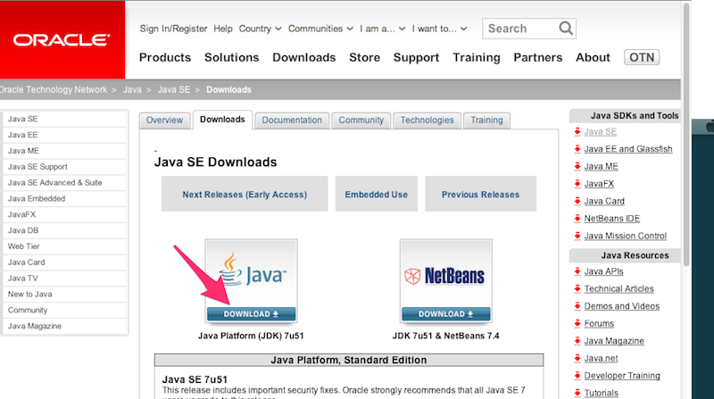

Click the button above "Java Platform (JDK)," as you can see in the above picture. Then you will come to a page that will have the following table on it:

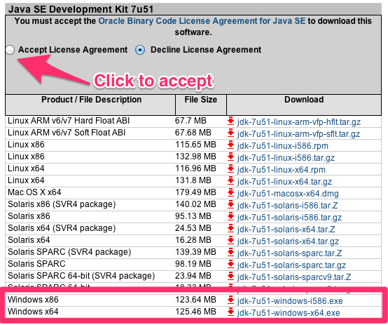

Click the radio button to accept the license agreement, and then download one of the two Windows choices. If you are running 32-bit Windows, choose "Windows x86." If you are running 64-bit Windows, choose "Windows x64."

If you do not know if you are running 32-bit or 64-bit Windows, go to the "Windows" screen (the "Start Screen") and type "system." Choose "System." (If that does not work, type "Control Panel" and choose "System" from the Control Panel screen.) You should see a window like the following:

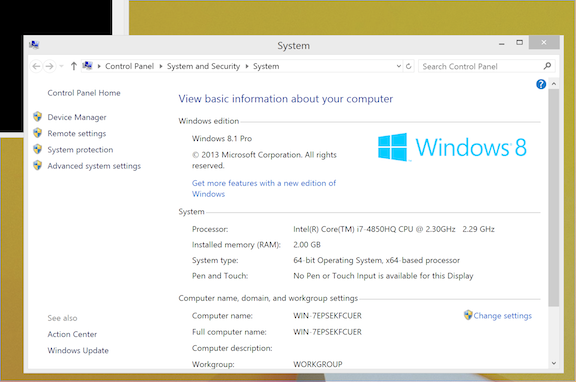

You should see if you are running 32- or 64-bit Windows beside "System Type."

Once you have downloaded the right Java version, run the executable you downloaded to install Java. Follow the installation wizard.

## Install Leiningen

Leiningen is a tool used on the command line to manage Clojure projects.

> see troubleshooing for leiningen installation

Next, go back to [the Leiningen Windows installer site](http://leiningen-win-installer.djpowell.net/) and download the file linked as "leiningen-win-installer." Run this executable and follow the "Detailed installation" section at the Leiningen Windows Installer site. At the end of the installation, leave "Run a Clojure REPL" checked before you click "Finish." If a terminal window opens that looks like the one on the Leiningen Windows installer site, then you are good to go.


## Install Nightcode

Go to the [Nightcode releaes site](http://github.com/oakes/Nightcode/releases).
On the page there, you should see version numbers and links to download specific version of Nightcode, for example, Nightcode-2.1.0.jar.
Click the link ending in `.jar` and you will download a file, `Nightcode-x.y.z.jar`.

> Don't download platform specific binary releases.
> Use jar archive.
> Jar archive is much easier to get started.

Once the download finished, we want to start the editor.
To startup, go into your Downloads folder (or wherever you save files from your browser) and run the Nightcode-x.y.z.jar file using `java` command.


Open a command prompt and run the following commands:

```bash
cd ~/Downloads/
java -jar Nightcode-2.1.0.jar
```

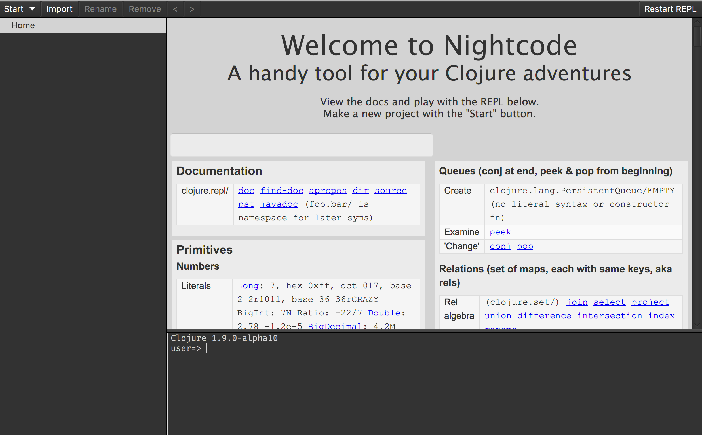


## Test your setup

You have set up Java, Leiningen, Nightcode, and Git on your computer--all the tools you will need for this workshop. Before starting, we need to test them out.

#### Testing Leiningen

Open a new terminal and run the following command:

```bash
lein new myproject
```

This will create a new project, `myproject`, which has files to form a Clojure project.
Normally, Clojure code exists within such Clojure project.

Run following commands:

```bash
cd myproject
lein repl
```

This may take long to start up for the first time.
Leiningen downloads libraries it needs to run Clojure.
When Leiningen starts, you'll see `user=>` prompt on your terminal.


Now, you are ready to use __REPL__, which we learn about soon.
It's a special terminal for Clojure.

At the REPL prompt, type `(+ 1 1)` and press Return. Did you get the answer `2` back? Great!

Your leiningen install looks good. For now, press the Control button and D button on your keyboard together (abbreviated as Ctrl+D). This should take you out of the Clojure REPL and back to your normal terminal prompt. Then, the terminal will show you the following message: `user=> Bye for now!`


#### Cloning out github repository

Go to your command prompt and run the following command:


```bash
git clone https://github.com/ClojureBridge/welcometoclojurebridge
```

This will clone `welcometoclojurebridge` repository which includes sample Clojure apps.
Your command prompt should look similar to this picture:


Once it finishes, type following commands on the same terminal.

```bash
cd welcometoclojurebridge
dir
```

You'll see the list of folders/files like this:

```
README.md       outline         project.clj     resources       src
```


#### Testing Nightcode

If Nightcode isn't started yet or closed, open it by typing the command on the command propmt:

```bash
java -jar Nightcode-2.1.0.jar
```

At the bottom right of the screen, type `(+ 1 1)` into the window. It should look like the following image:


If you see the result, 2, that worked, great!


#### Testing apps

Now we will open and run the sample Clojure apps in Nightcode.
On the top left corner, click "Import" then find the directory,
`welcometoclojurebridge`, which was created when you ran
`git clone` command. Click "Open."
In the project directory tree on the left, click on `src` - `welcometoclojurebridge` - `core.clj`. The `core.clj` file will be opened on the right side.
This is a Clojure program.

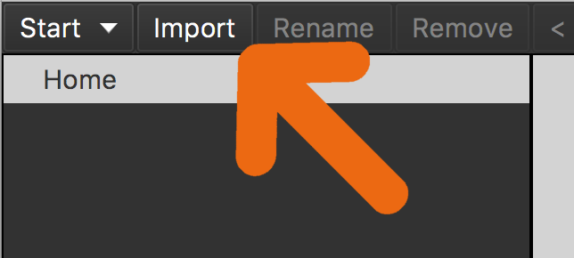
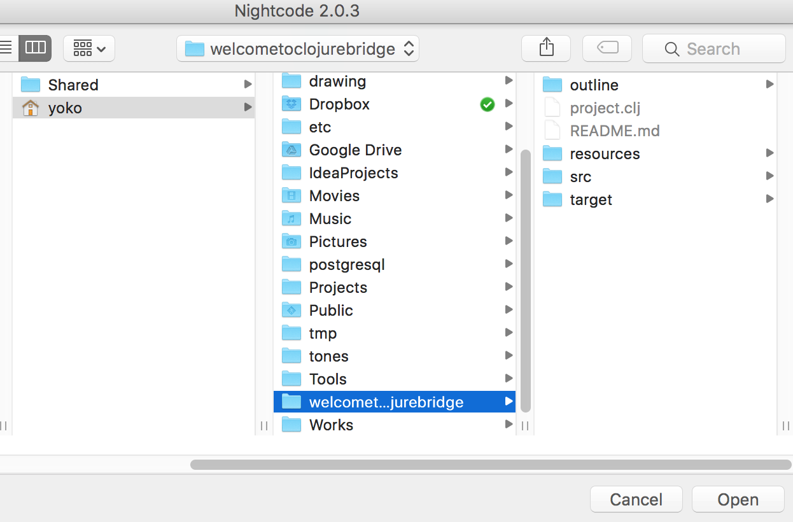
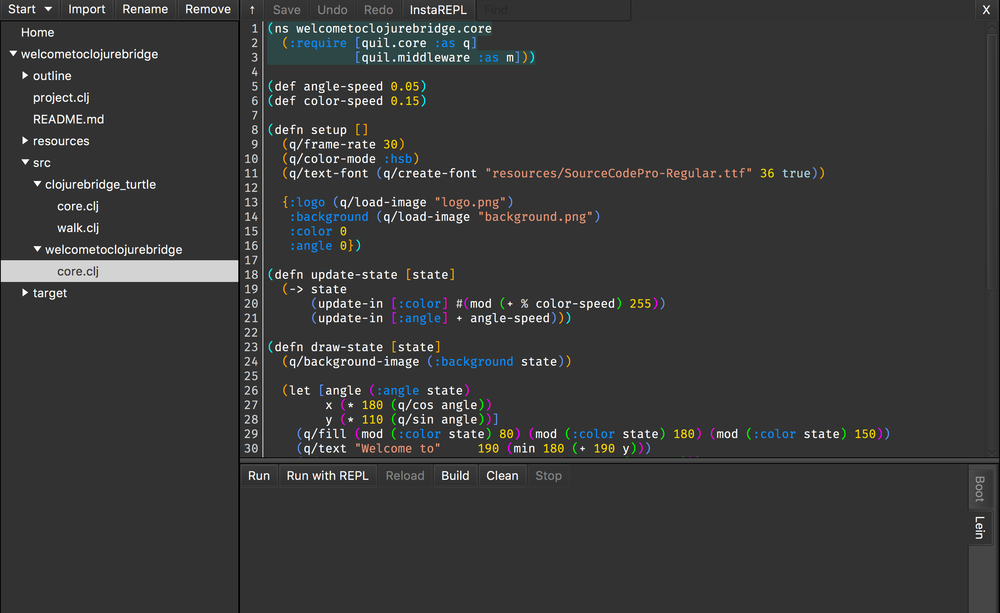


The next step is to run the code shown in the window.
Click "Run with REPL" on the bottom.
It may take a while.
Eventually, REPL will start and show a prompt, `user=>`.
Once, you see the prompt, click "Reload" button.


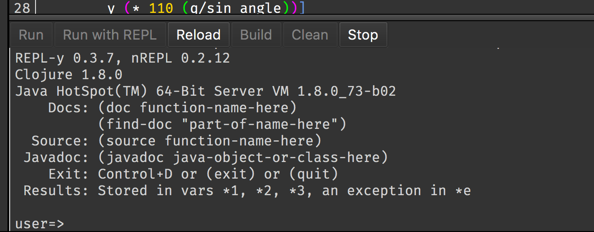
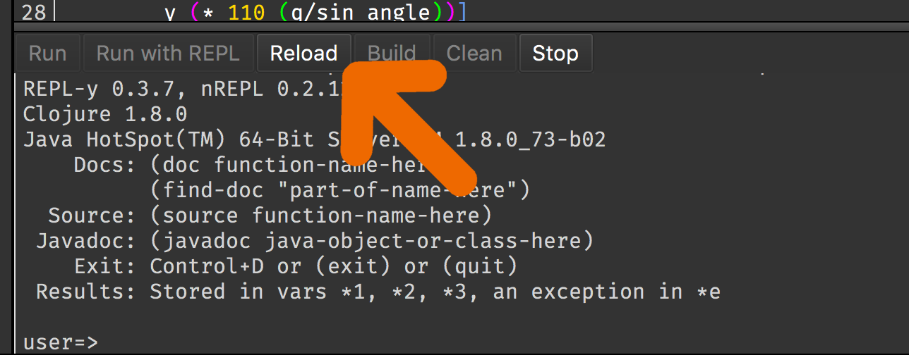


You should see a fun welcome message.

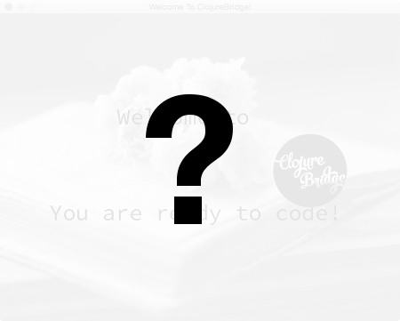


Let's try one more sample.
In the directory tree on the left, click on
`welcometoclojurebridge` - `src` - `clojurebridge-turtle` -
`walk.clj`. The `walk.clj` file will open on the right side.
Like we did before, click "Reload" button.

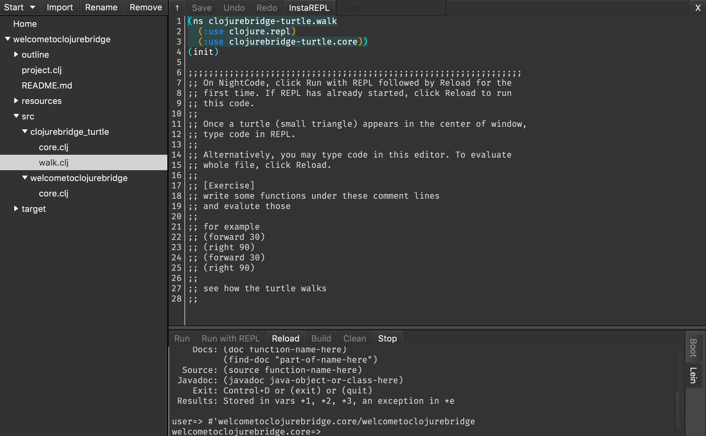
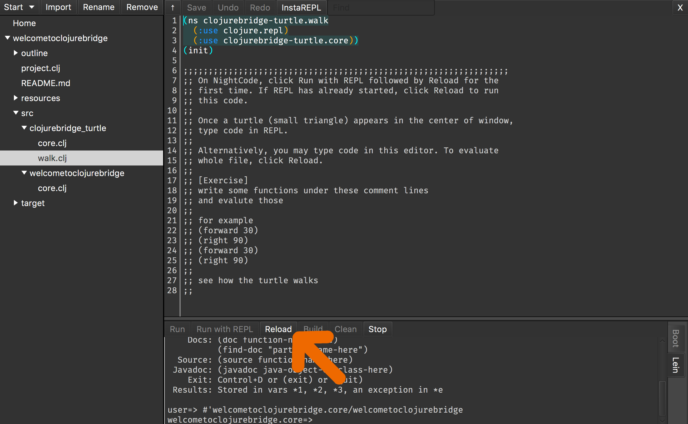

An initial image of the turtles app should pop up.
A small triangle on the center is the *turtle*.


Type `(forward 40)` on the repl at the bottom of the window.
You should see the turtle moved upword:

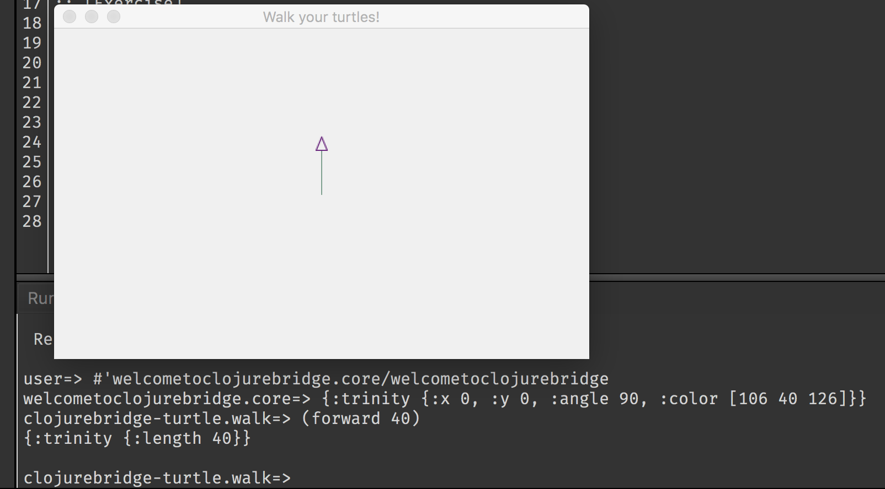


#### Success!

Congratulations! You have opened and run your first Clojure apps, and
your install and setup are all completed!


If you want to know what the turtle (*a small triangle*) can do,
see [Turtle App API](https://github.com/ClojureBridge/welcometoclojurebridge/blob/master/outline/TURTLE.md) and
[How to Walk Turtles](https://github.com/ClojureBridge/welcometoclojurebridge/blob/master/outline/TURTLE-SAMPLES.md) for more information.


### Troubleshooting

* Leiningen Windows Installer has an issue that it doesn't install
  lein.bat correctly. This causes curl.exe to fail downloading files
  with th error below. Skip the Leiningen Windows Installer. Download
  lein.bat from leiningen.org and run self-installer.

> error:0307A071:bignum routines:BN_rand_range:too many iterations.
