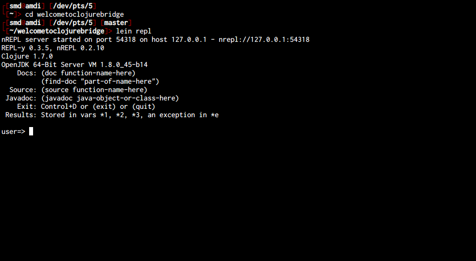

Windows 8 Setup
===============

* Start a command prompt
* Get Java installed
* Get Leiningen installed
* Get Nightcode installed
* Get Git installed
* Test installation

## Starting a command prompt

For these instructions, and for much of the class, you will need to have a command prompt open. This is a text-based interface to talk to your computer. Go to the "Windows" screen (the "Start Screen") and type "command". Choose the "Command Prompt" program, like in this screenshot:


When you choose "Command Prompt," your screen should look similar to this:


If you have never used the command prompt before, you may want to spend some time [reading up on command prompt basics](http://dosprompt.info/). For the rest of this setup, I will tell you to run commands in your command prompt. When I say that, I mean "type the command into the command prompt and press the Return key."

On other operating systems, the command prompt is called the terminal. We will use the terms terminal, command prompt, and command line interchangably.

## Installing Java

Go to [the Leiningen Windows installer site](http://leiningen-win-installer.djpowell.net/). You should see two links, one for installing Java and another for "leiningen-win-installer." Click the Java link. Then, you should see a screen like the following:


Click the button above "Java Platform (JDK)," as you can see in the above picture. Then you will come to a page that will have the following table on it:


Click the radio button to accept the license agreement, and then download one of the two Windows choices. If you are running 32-bit Windows, choose "Windows x86." If you are running 64-bit Windows, choose "Windows x64."

If you do not know if you are running 32-bit or 64-bit Windows, go to the "Windows" screen (the "Start Screen") and type "system." Choose "System." (If that does not work, type "Control Panel" and choose "System" from the Control Panel screen.) You should see a window like the following:


You should see if you are running 32- or 64-bit Windows beside "System Type."

Once you have downloaded the right Java version, run the executable you downloaded to install Java. Follow the installation wizard.

## Installing Leiningen

Leiningen is a tool used on the command line to manage Clojure projects.

Next, go back to [the Leiningen Windows installer site](http://leiningen-win-installer.djpowell.net/) and download the file linked as "leiningen-win-installer." Run this executable and follow the "Detailed installation" section at the Leiningen Windows Installer site. At the end of the installation, leave "Run a Clojure REPL" checked before you click "Finish." If a terminal window opens that looks like the one on the Leiningen Windows installer site, then you are good to go.

## Installing Nightcode

Go to the [Nightcode site](https://sekao.net/nightcode/). On the page there, click the "Free Download" link and you will download a .jar file. There should now be a file named `nightcode-0.4.7-standalone.jar` in your Downloads folder. If Java is installed, you can double click the JAR file to run it.

The first time you launch Nightcode it will look like this:


## Installing Git

See if you already have Git installed at the command prompt with the command `git --version`.
If not, download it from the [git-scm.com Windows download page](http://git-scm.com/download/win) and run the executable to install.

After installation, try the `git --version` command in a new command prompt window. If you see a version number, git
was installed correctly.

If you see a message that says, `'git' is not recognized as an internal or external command`,
try these steps to update your PATH variable properly:
* Right-click "My Computer" and select "Properties".
* Click the "Advanced Tab" and then the "Environment Variables" button.
* Highlight the PATH entry and click "Edit".
* Scroll to the end of this value and check for a file path at the end that includes "...\Git...".
* If that path existed:
  * Click "Okay" until the "My Computer" dialog box is closed.
  * Open a new command prompt window and try `git --version` again. If that does not succeed, restart your computer and
    try again.
* If that path did not exist:
  * If you did not change the install location of git during installation, add ";C:\Program Files (x86)\Git\cmd" to the
    end of the line. Make sure you add the semi-colon between file paths and the line includes no spaces between paths.
  * Click "Okay" until the "My Computer" dialog box is closed.
  * Open a new command prompt window and try `git --version` again. If that does not succeed, restart your computer and
    try again.

If you've used Git before then you should already have user.name and user.email configured.
Otherwise, type this in the command prompt:

```
git config --global user.name "Your Actual Name"
git config --global user.email "Your Actual Email"
```
TIP: Use the same email address for git, github, and ssh.

Verify by typing this in the command prompt:

`git config --get user.name`
Expected result:
`your name`

`git config --get user.email`
Expected result:
`your email address`

## Testing your setup

You have set up Java, Leiningen, Nightcode, and Git on your computer--all the tools you will need for this course. Before starting, we need to test them out. Make sure you have a terminal (OS X) or command prompt (Windows) open for testing. We will just call this a terminal from now on.

Go to your terminal and run the following command:

```
git clone https://github.com/ClojureBridge/welcometoclojurebridge
```

This will clone a sample Clojure application.


Then run the command:

```
cd welcometoclojurebridge
```

This will put you in the directory with the source code for this sample bit of Clojure code. After that completes, run:

```
lein repl
```

This could take a long time, and will download many other pieces of code it relies on. You might see lines that start with `Retrieving ...` on your screen. When it finishes, your terminal should look like the following:



This is starting a REPL, which we will learn about soon. It's a special terminal for Clojure. At the REPL prompt, type `(+ 1 1)` and press Return. Did you get the answer `2` back? You will learn more about that in the course. For now, press the Control button and d button on your keyboard together (abbreviated as Ctrl-d). This should take you out of the Clojure REPL and back to your normal terminal prompt. Then, the terminal will show you the following message: `user=> Bye for now!`

Now we will open and run the sample Clojure app in Nightcode. Start Nightcode, and once it is started, click the "Import" button. Find the directory you created earlier, `welcometoclojurebridge` and click "Open."


In the workspace menu on the left, click on welcometoclojurebridge - src - welcometoclojurebridge - core.clj. Double-click the core.clj file to open it. This is a Clojure program.


Click on the file contents and press the "Run with REPL" button. It should look something like this:


Once the REPL is loaded, press the "Reload" button to run the code. Nightcode will load the program and you should see a fun welcome message.

Congratulations! You have opened and run your first Clojure app, and your install and setup are complete!
