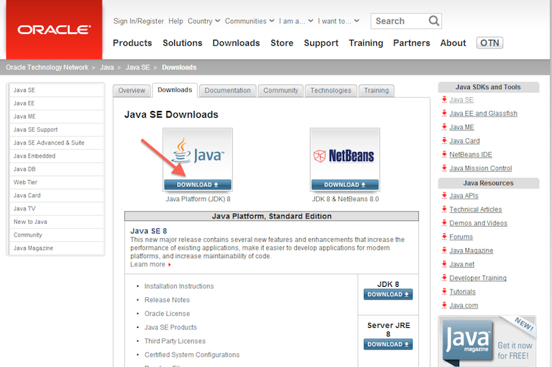

Windows 8 Setup
===============

* Start a command prompt
* Install Git
* Configure Git
* Install Java
* Install Leiningen
* Install Light Table
* Test your setup
* Troubleshooting

## Starting a command prompt

For these instructions, and for much of the class, you will need to have a command prompt open. This is a text-based interface to talk to your computer. Go to the "Windows" screen (the "Start Screen") and type "command". Choose the "Command Prompt" program, like in this screenshot:


When you choose "Command Prompt," your screen should look similar to this:


If you have never used the command prompt before, you may want to spend some time [reading up on command prompt basics](http://dosprompt.info/). For the rest of this setup, I will tell you to run commands in your command prompt. When I say that, I mean "type the command into the command prompt and press the Return key."

On other operating systems, the command prompt is called the terminal. We will use the terms terminal, command prompt, and command line interchangably.

## Installing Git

See if you already have Git installed at the command prompt with the command `git --version`.
If not, download it from the [git-scm.com Windows download page](http://git-scm.com/download/win) and run the executable to install.

After installation, try the `git --version` command in a new command prompt window. If you see a version number, git
was installed correctly.

If you see a message that says, `'git' is not recognized as an internal or external command`,
try these steps to update your PATH variable properly:
* Right-click "My Computer" and select "Properties".
* Click the "Advanced Tab" and then the "Environment Variables" button.
* Highlight the PATH entry and click "Edit".
* Scroll to the end of this value and check for a file path at the end that includes "...\Git...".
* If that path existed:
  * Click "Okay" until the "My Computer" dialog box is closed.
  * Open a new command prompt window and try `git --version` again. If that does not succeed, restart your computer and
    try again.
* If that path did not exist:
  * If you did not change the install location of git during installation, add ";C:\Program Files (x86)\Git\cmd" to the
    end of the line. Make sure you add the semi-colon between file paths and the line includes no spaces between paths.
  * Click "Okay" until the "My Computer" dialog box is closed.
  * Open a new command prompt window and try `git --version` again. If that does not succeed, restart your computer and
    try again.

If you've used Git before then you should already have user.name and user.email configured.
Otherwise, type this in the command prompt:

## Configure Git

```
git config --global user.name "Your Actual Name"
git config --global user.email "Your Actual Email"
```
TIP: Use the same email address for git, github, and ssh.

Verify by typing this in the command prompt:

`git config --get user.name`
Expected result:
`your name`

`git config --get user.email`
Expected result:
`your email address`


## Install Java

Go to [the Leiningen Windows installer site](http://leiningen-win-installer.djpowell.net/). You should see two links, one for installing Java and another for "leiningen-win-installer." Click the Java link. Then, you should see a screen like the following:



Click the button above "Java Platform (JDK)," as you can see in the above picture. Then you will come to a page that will have the following table on it:


Click the radio button to accept the license agreement, and then download one of the two Windows choices. If you are running 32-bit Windows, choose "Windows x86." If you are running 64-bit Windows, choose "Windows x64."

If you do not know if you are running 32-bit or 64-bit Windows, go to the "Windows" screen (the "Start Screen") and type "system." Choose "System." (If that does not work, type "Control Panel" and choose "System" from the Control Panel screen.) You should see a window like the following:


You should see if you are running 32- or 64-bit Windows beside "System Type."

Once you have downloaded the right Java version, run the executable you downloaded to install Java. Follow the installation wizard.

## Install Leiningen

Leiningen is a tool used on the command line to manage Clojure projects.

> see troubleshooing for leiningen installation

Next, go back to [the Leiningen Windows installer site](http://leiningen-win-installer.djpowell.net/) and download the file linked as "leiningen-win-installer." Run this executable and follow the "Detailed installation" section at the Leiningen Windows Installer site. At the end of the installation, leave "Run a Clojure REPL" checked before you click "Finish." If a terminal window opens that looks like the one on the Leiningen Windows installer site, then you are good to go.

## Install Light Table

Go to the [Light Table site](http://www.lighttable.com/). On the page there, you should see a set of buttons that have download links for Light Table. Click the "Win" button and you will download a .zip file.


Unzip this file (either by finding it in your Downloads folder and double-clicking it, or by choosing "Open" when downloading.) Inside the .zip file, there is a a directory called "Light Table". Drag this to your desktop. (If you know what you are doing and want this somewhere else, that is fine.)

Inside the Light Table directory, there is an application called Light Table. Right-click it and choose "Pin to Start Menu" so you can start it more quickly.


## Test your setup

You have set up Java, Leiningen, Light Table, and Git on your computer--all the tools you will need for this workshop. Before starting, we need to test them out. 

#### Cloning out github repository

Go to your command prompt and run the following command:


```bash
git clone https://github.com/ClojureBridge/welcometoclojurebridge
```

This will clone `welcometoclojurebridge` repository which includes sample Clojure apps.
Your command prompt should look similar to this picture:


Then run the command:

```bash
cd welcometoclojurebridge
```

This will take you to the folder with the source code. After that completes, run:

```bash
lein repl
```

This could take a long time, and will download many other pieces of code it relies on. You should see lines that start with `Retrieving ...` on your screen. When it finishes, your terminal should look like the following:


This is starting a REPL, which we will learn about soon. It's a
special command prompt for Clojure. At the REPL prompt, type `(+  1
1)` and hit enter. Did you get the answer `2` back? You will learn
more about that in the course. For now, press the Control button and D
button on your keyboard together (abbreviated as Ctrl+D). This should
take you out of the Clojure REPL and back to your normal command
prompt. Then, the command prompt will show you the following message: `user=> Bye for now!`

#### Testing Light Table

Now we will open and run the sample Clojure apps in Light Table, so start Light Table.

In Light Table, click on the menu "File" then choose "Open Folder." Find the
directory, `welcometoclojurebridge`, which was created when you ran
`git clone` command. Click "Upload." In the workspace menu on the
left, click on `welcometoclojurebridge` - `src` -
`welcometoclojurebridge` - `core.clj`. Double-click the `core.clj` file
to open it. This is a Clojure program.


Click on the file contents and
press the following key combination:

<kbd>Ctrl</kbd> + <kbd>Shift</kbd> + <kbd>Enter</kbd>

You should see a fun welcome message.


Next, in the workspace menu on the left, click on
`welcometoclojurebridge` - `src` - `clojurebridge-turtle` -
`walk.clj`. Double-click the core.clj file to open it.


press the following key combination:

<kbd>Ctrl</kbd> + <kbd>Shift</kbd> + <kbd>Enter</kbd>

An initial image of the turtles app will pop up.

Type `(forward 40)` at the end of the `walk.clj` and press the
following combination:

<kbd>Ctrl</kbd> + <kbd>Enter</kbd>

You should see this on the Light Table:


also, your turtle should move.

> press the Control button and Space Bar together (abbreviated Ctrl+Space). This is how you start giving Light Table a command

#### Success!

Congratulations! You have opened and run your first Clojure apps, and
your install and setup are all completed!


### Troubleshooting

* If you receive errors while running Light Table about Java or JDK,
  these may be resolved by finishing the installation of Leiningen
  first. If not, see a TA to look at your environment variables.

* Leiningen Windows Installer has an issue that it doesn't install
  lein.bat correctly. This causes curl.exe to fail downloading files
  with th error below. Skip the Leiningen Windows Installer. Download
  lein.bat from leiningen.org and run self-installer.

> error:0307A071:bignum routines:BN_rand_range:too many iterations.
