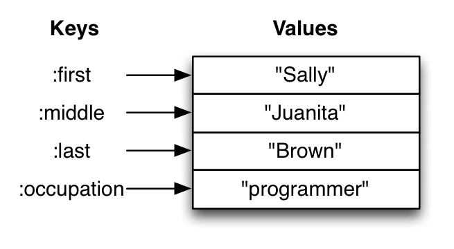

# Module 6 - More Data Structures!

# Maps

~~~
    {:first "Sally", :last "Brown", :job "programmer"}
    {:a 1, :b "two"}
    {}
~~~

Similar to comments, commas are ignored by REPL

# Map functions

~~~
  (map? {:first "Sally" :last "Brown"})       ;; => true

  (get {:first "Sally" :last "Brown"} :first) ;; => "Sally"

  (get {:first "Sally"} :last :MISS)          ;; => :MISS
~~~

# More map function

~~~
    (assoc {:first "Sally"} :last "Brown")
       ;; => {:first "Sally", :last "Brown"}

    (dissoc {:first "Sally" :last "Brown"} :last)
       ;; => {:first "Sally"}

    (merge {:first "Sally"} {:last "Brown"})
       ;; => {:first "Sally", :last "Brown"}

    (count {:first "Sally" :last "Brown"})
       ;; => 2
~~~

# Even more map functions

~~~
    (keys {:first "Sally" :last "Brown"})
      ;; => (:first :last)

    (vals {:first "Sally" :last "Brown"})
      ;; => ("Sally" "Brown")
~~~

# Maps and keywords

~~~
    (:first {:first "Sally" :last "Brown"})
      ;; => "Sally"

    (:last {:first "Sally"})
      ;; => nil

    (:last {:first "Sally"} :MISS)
      ;; => :MISS
~~~

# Exercise: Modeling yourself

Make a map representing yourself. Make sure it contains your first
name and last name. Then, add your hometown to the map using `assoc`
or `merge`.

# Collections of collections

~~~
  [{:name "Mercury"}
   {:name "Venus"}
   {:name "Earth" :moons ["The Moon"]}
   {:name "Mars" :moons ["Phobos" "Deimos"]}
   {:name "Jupiter"
   :moons ["Ganymede" "Callisto" "Io" "Europa"]}]
~~~

# Exercise: Get the names of people

Create a function called `get-names` that takes a vector of maps of
people and returns a vector of their names.

~~~
    (get-names [{:first "Margaret" :last "Atwood"}
                {:first "Doris" :last "Lessing"}
                {:first "Ursula" :last "Le Guin"}
                {:first "Alice" :last "Munro"}])

                ;; => ["Margaret Atwood" "Doris Lessing"
                ;;    "Ursula Le Guin" "Alice Munro"]
~~~

Hint: First, create a function that returns the name when given a
single person's map.

# Exercise: Modeling your classmates
Take the map from a recent exercise -- the one about you.

Find two or three classmates. Ask their name and hometown. Make a
vector of maps with their information.

Then, add your information to their information using `conj`.
